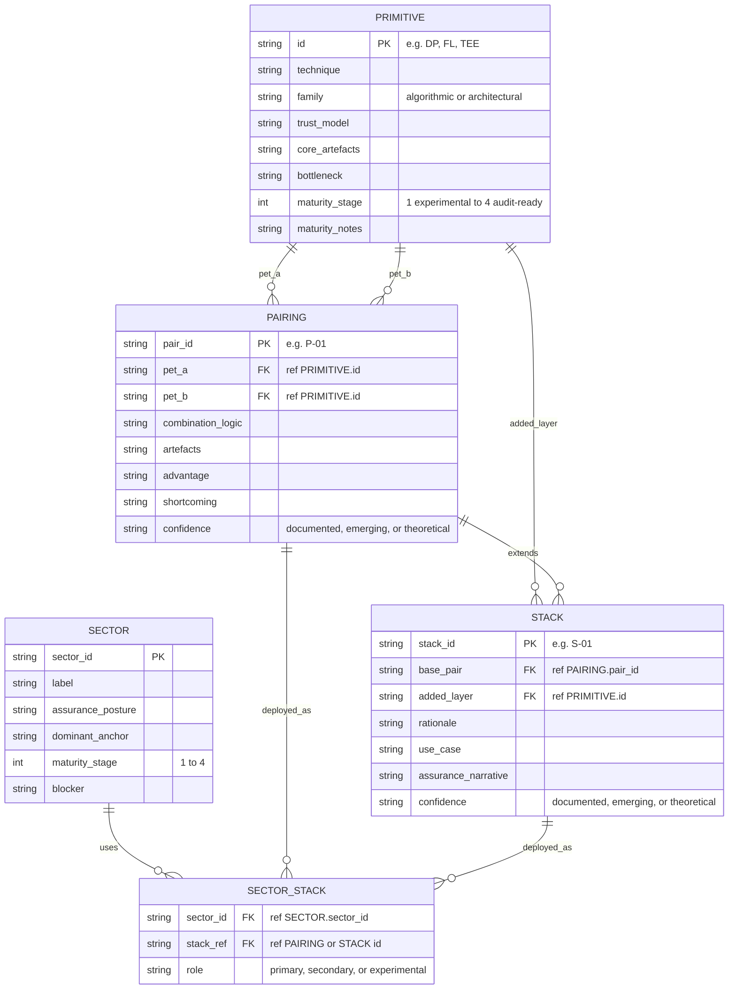
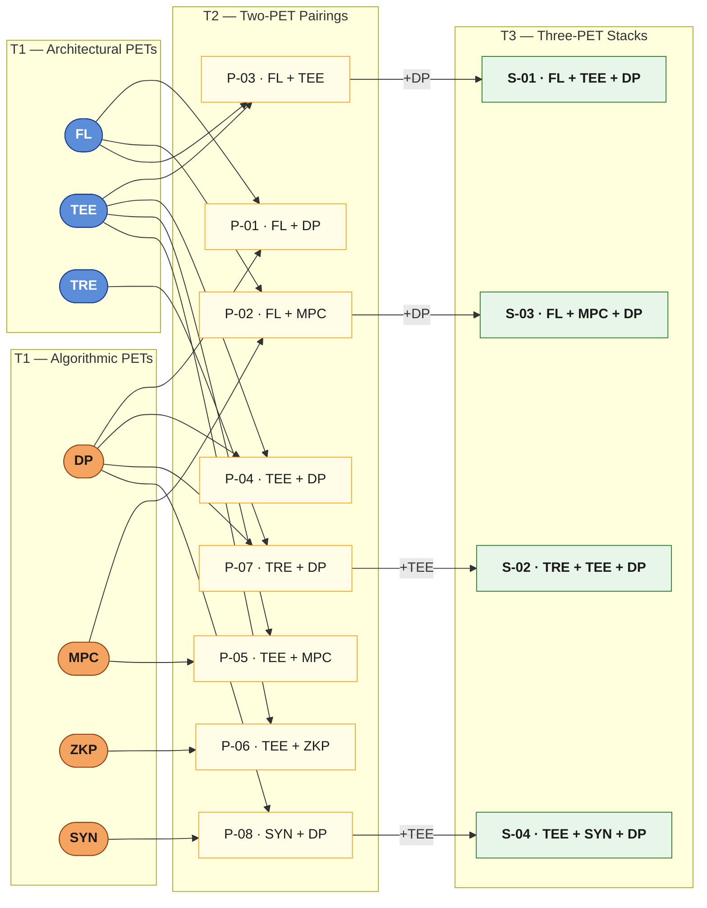

# PET Combination Diagrams

> **These diagrams are suggestive and indicative.** Maturity assessments, sector mappings, and combination choices reflect a reading of available peer-reviewed literature and documented deployments at time of writing. Reasonable experts will disagree — particularly on maturity stages, which are sensitive to sector context, organisational capacity, and the evidence threshold you apply. The [YAML data files](data/) are the intended entry point for forking and revising any of these assessments independently.

Three diagrams follow. They share the same IDs as the [README tables](README.md) — primitives in `T1`, pairings in `T2`, stacks in `T3`, sectors in `T4` — and can be read as a layered view of the same underlying data model.

---

## Diagram 1 — Relational Schema

How the four tables relate to each other. This is the abstract data model, not the content.

---

## Diagram 2 — PET Combination Network

How individual primitives (T1) compose into pairings (T2) and how pairings extend into three-layer stacks (T3). Orange = algorithmic PETs; blue = architectural PETs. Edge labels on T2→T3 transitions show which primitive was added.

> **Reading the diagram.** Arrows from T1 into T2 mean "this primitive appears in this pairing." Arrows from T2 into T3 are labelled with the added layer — they represent the base pair being extended, not a new input. Empty T2 cells (e.g. `HE+FL`, `MPC+DP` standalone) are absent because the literature does not yet provide sufficient assurance-coherent deployment evidence to justify a row; they are candidates for future iterations.

---

## Diagram 3 — Sectoral Deployment Map

Which T2 pairings and T3 stacks are most associated with each sector. This reflects dominant assurance posture rather than exhaustive cataloguing — a sector may use other combinations in niche or experimental settings.

```mermaid
flowchart TD
    classDef sector fill:#e3f2fd,stroke:#1565c0,color:#1a1a1a,font-weight:bold
    classDef pair fill:#fffde7,stroke:#f9a825,color:#1a1a1a
    classDef stack fill:#e8f5e9,stroke:#2e7d32,color:#1a1a1a,font-weight:bold

    PUB["Public Sector\n/ Official Statistics"]:::sector
    HEALTH["Healthcare\n/ Biomedical"]:::sector
    FIN["Finance\n/ Inter-org Analytics"]:::sector
    TECH["Technology Platforms\n/ Consumer AI"]:::sector
    WEB3["Web3\n/ Verifiable Infrastructure"]:::sector

    P07_a["P-07\nTRE+DP"]:::pair
    S02_a["S-02\nTRE+TEE+DP"]:::stack
    P08_a["P-08\nSYN+DP"]:::pair

    P01_a["P-01\nFL+DP"]:::pair
    P03_a["P-03\nFL+TEE"]:::pair
    S01_a["S-01\nFL+TEE+DP"]:::stack

    P05_a["P-05\nTEE+MPC"]:::pair
    P04_a["P-04\nTEE+DP"]:::pair
    P06_a["P-06\nTEE+ZKP"]:::pair

    P01_b["P-01\nFL+DP"]:::pair
    P02_a["P-02\nFL+MPC"]:::pair
    P04_b["P-04\nTEE+DP"]:::pair

    P06_b["P-06\nTEE+ZKP"]:::pair

    PUB --> P07_a & S02_a & P08_a
    HEALTH --> P01_a & P03_a & S01_a
    FIN --> P05_a & P04_a & P06_a
    TECH --> P01_b & P02_a & P04_b
    WEB3 --> P06_b
```

> **Note on duplicated nodes.** Some pairs (e.g. `P-01 FL+DP`, `P-04 TEE+DP`, `P-06 TEE+ZKP`) appear in multiple sectors. They are duplicated here for layout clarity; in the data model they are single rows referenced by multiple `SECTOR_STACK` entries.

---

## How to Fork and Extend These Diagrams

The diagrams above are generated from the structured data in [`data/`](data/). To propose different maturity assessments, add new combinations, or map a sector you know well:

1. **Edit the YAML source files** in `data/` — each file corresponds to one table. IDs cross-reference across files. See the [schema notes](data/) for field definitions.
2. **Regenerate or hand-edit the tables** in `README.md` to match your revised data. (A generation script is a planned iteration — see below.)
3. **Update Diagram 2 and/or Diagram 3** above to reflect added nodes. Mermaid syntax is plain text; new primitives, pairings, or stacks can be added by following the existing node/edge patterns.

Contributions that are most useful:
- **Contested maturity entries** — if you have deployment evidence that places a combination at a different stage, note the evidence in the YAML `maturity_notes` field and open a PR.
- **New combinations** — must include an `artefacts` list and at least one `reference` to be admitted to T2 or T3. Theoretical combinations without assurance artefacts belong in a separate `speculative/` folder (planned).
- **Sector entries** — particularly welcome for jurisdictions and sub-sectors not currently represented.

---

## Suggested Further Iterations

The following changes would materially strengthen this resource. They are ordered roughly by impact.

### 1. Add a `confidence` level to every T2 and T3 entry

Current entries mix peer-reviewed deployments with practitioner-reported combinations. Adding a `confidence` field — e.g. `peer_reviewed`, `deployment_documented`, `practitioner_reported`, `theoretical` — would let readers calibrate how much weight to give each row and make the suggestive/evidenced distinction explicit in the data rather than only in prose.

### 2. Expand T2 to include underrepresented combinations

`HE + FL`, `MPC + DP` (standalone, not inside FL), and `TRE + SYN` are absent because deployment evidence is thin, but they are analytically important. Adding them with a `confidence: theoretical` flag and a note on what assurance evidence is missing would make the empty-cell rationale explicit.

### 3. Add a T5: Excluded Combinations registry

A short table documenting combinations that were considered and excluded — with the reason (e.g. "no assurance-coherent deployment found", "incompatible threat models", "governance misalignment") — would strengthen the argument that the design space is narrow for substantive reasons, not selective omission. This directly addresses the combinatorics-vs-practice gap in Section 7 of the paper.

### 4. Add temporal fields

`first_documented` and `evidence_last_updated` fields in `pairings.yaml` and `stacks.yaml` would let readers see which combinations are established versus newly emerging and would prevent the resource from appearing more stable than it is over time.

### 5. Add deployment evidence URLs

A `references` list in each T2/T3 entry currently uses citation strings. Adding optional `url` sub-fields would let readers verify claims directly and would make this useful as a living evidence base rather than a static table.

### 6. Build a table-generation script

A lightweight Python script (`scripts/generate_tables.py`) that reads the four YAML files and outputs the `README.md` tables would close the gap between source data and rendered documentation. This makes the YAML canonical and prevents tables drifting from data across edits.

### 7. Add a `risk_notes` field to T2 and T3

The current `shortcoming` field is high-level. A separate `risk_notes` field — listing known failure modes, composability hazards, or implementation pitfalls for each combination — would make this more directly useful for practitioners conducting threat modelling. This maps directly to Section 3.4 (Composability and Interface Hazards) of the paper.

### 8. Extend T4 with sub-sector granularity

Healthcare currently covers both cross-institutional research (where FL+DP is dominant) and clinical operational settings (where TEE+DP is more common). Splitting coarse sectors into sub-sectors with their own stack preferences would sharpen the mapping and reduce overgeneralisation.

### 9. Add a maturity trajectory field

Rather than a single point estimate (`maturity_stage: 2`), a `maturity_trajectory` field — e.g. `stable`, `improving`, `stalled` — would capture directional movement and help practitioners assess whether a combination is converging toward standardised assurance or plateauing.

### 10. Interactive rendering

The Mermaid diagrams here are static. A D3.js or Observable notebook rendering of the same data would allow filtering by sector, maturity stage, or technique family — making the relational structure explorable rather than just readable. This is a natural next step once the YAML data model stabilises.
