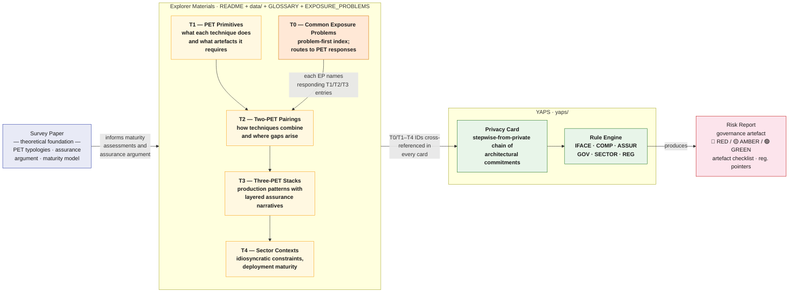

# Privacy Explorer

A companion repository to the survey paper *Survey of PETs Adoption in Real-World Applications* (Smith, 2026) — providing structured, implementation-centred reference materials for reasoning about PET combinations, deployment maturity, and assurance artefacts, together with **YAPS** (Yet Another Privacy Sandbox), a conceptual risk-assessment tool for privacy architecture decisions.

> The survey argues that PET viability depends less on cryptographic strength and more on whether privacy claims can be rendered into repeatable, inspectable assurance artefacts. This repository encodes that argument in two complementary forms: a **problem-first index** (T0 — common exposure problems) and a **technique-first set of relational tables** (T1–T4 — primitives, pairings, stacks, sector contexts).

> **These materials are suggestive and indicative, not prescriptive.** Maturity stage assessments reflect a reading of available peer-reviewed literature and documented deployments at time of writing. Reasonable experts will disagree. The [YAML data files](data/) are the canonical source for forking and revising any entry.

**How to cite this repository:** see [CITATION.cff](CITATION.cff). Please cite both this repository and the survey paper.

---

## Navigation

| Resource | Purpose |
|---|---|
| **This file** | Conceptual architecture and reference tables (T0–T4) |
| [GLOSSARY.md](GLOSSARY.md) | Formalised terms used across the framework, with primary-source citations |
| [EXPOSURE_PROBLEMS.md](EXPOSURE_PROBLEMS.md) | T0 — the problem-first index complementing T1–T4 |
| [STEPWISE_RISK.md](STEPWISE_RISK.md) | The methodology for constructing privacy cards: stepwise-from-private |
| [DIAGRAM.md](DIAGRAM.md) | Visual diagrams — ER schema, combination network, sector map, card architecture |
| [EXCLUDED_COMBINATIONS.md](EXCLUDED_COMBINATIONS.md) | T5 — assessed and excluded combinations, an audit trail for what didn't make T2/T3 and why |
| [TOOLING.md](TOOLING.md) | Where to start looking for a real library per primitive/pairing — high-level pointers, not vetted, PRs welcome |
| [CONTRIBUTING.md](CONTRIBUTING.md) | How to contribute — rules, cards, data entries, tool references |
| [CITATION.cff](CITATION.cff) | Citation metadata for the repository |
| [workshops/](workshops/) | Workshop materials (W1–W4) for testing the framework with practitioners |
| [data/exposure_problems.yaml](data/exposure_problems.yaml) | T0 source data |
| [data/primitives.yaml](data/primitives.yaml) | T1 source data — primitives including DP-L (local) and DP-C (central) variants |
| [data/pairings.yaml](data/pairings.yaml) | T2 source data — two-PET pairings, aligned with survey paper Table 4.2 |
| [data/stacks.yaml](data/stacks.yaml) | T3 source data — three-PET stacks |
| [data/sectors.yaml](data/sectors.yaml) | T4 source data — sector mappings with idiosyncratic constraints |
| [data/exclusions.yaml](data/exclusions.yaml) | T5 source data — assessed/excluded combinations, promotion audit trail |
| [yaps/](yaps/) | YAPS — privacy card architecture and risk engine |
| [yaps/frontend/index.html](yaps/frontend/index.html) | Interactive sandbox — open in a browser, no server required |
| [yaps/cards/examples/](yaps/cards/examples/) | Example privacy cards: healthcare, public sector, finance |
| [yaps/rules/rules.yaml](yaps/rules/rules.yaml) | Risk rule set — fork to contest or extend |
| [yaps/RISK_MODEL.md](yaps/RISK_MODEL.md) | How the risk model works — logic, NIST/NCSC alignment, privacy vs security distinction |
| [yaps/CARDS_GUIDE.md](yaps/CARDS_GUIDE.md) | Modular card guide |
| [workbench/](workbench/) | **WIP** local sandbox — Dockerised FastAPI + Elasticsearch app that consumes the framework's canonical YAML, schemas, and rules for workshop use |

---

## Conceptual Architecture

This repository is structured as three connected layers, each building on the last. The framework can be entered from either a **problem-first** direction (T0 → responding combinations) or a **technique-first** direction (T1 → T2 → T3 → T4) depending on the practitioner's task.



**Layer 1 — Survey paper.** The theoretical foundation: PET typologies, the assurance-gap argument, the claim that deployment viability is determined by whether artefacts can be rendered repeatable and inspectable.

**Layer 2 — Explorer materials (T0–T4).** The argument encoded structurally.
- **T0** ([EXPOSURE_PROBLEMS.md](EXPOSURE_PROBLEMS.md)) is a **problem-first** index — for practitioners who have a concrete exposure problem and want to know which PETs respond.
- **T1–T4** are the **technique-first** tables — for readers who want a relational view of mechanisms, combinations, stacks, and sectors.
- The two views complement each other; T0 and T2 are cross-linked by foreign keys.

**Layer 3 — YAPS.** The argument operationalised at the level of a specific deployment. A Privacy Card commits to a concrete architecture using the **[stepwise-from-private](STEPWISE_RISK.md)** construction methodology: each PET-enabled access pattern is recorded as an explicit deviation from a completely-private baseline, with a named purpose, exposure problem, PET response, trust assumption, assurance anchor, and residual risk. The rule engine surfaces gaps in the resulting chain.

**Cross-cutting:** [GLOSSARY.md](GLOSSARY.md) defines a small, citable vocabulary used consistently across all layers. The [workshops/](workshops/) directory provides materials for testing the framework with practitioners.

---

## Reference materials — T0 through T4

The materials below are designed to be read relationally. **T0** is the problem-first entry point: name your exposure problem, route to responding PETs. **T1–T4** are the technique-first entry point: see what each PET does, how pairs interact, what three-layer stacks exist, how sectors use them. The two views are linked by foreign keys.

Table cells below are deliberately short — a scannable index, not the full record. Where a cell is cut off or shows `(+N more)`, the complete text lives in the linked YAML under [`data/`](data/), generated verbatim by [`scripts/generate_tables.py`](scripts/generate_tables.py).

Cross-references use the short IDs defined in [data/exposure_problems.yaml](data/exposure_problems.yaml) (T0), [data/primitives.yaml](data/primitives.yaml) (T1), and the subsequent tables.

---

### T0 — Common Exposure Problems (problem-first index)

The full T0 index lives in [EXPOSURE_PROBLEMS.md](EXPOSURE_PROBLEMS.md), with canonical entries in [data/exposure_problems.yaml](data/exposure_problems.yaml). A summary:

<!-- AUTOGEN:T0 START — generated by scripts/generate_tables.py from data/exposure_problems.yaml. Do not hand-edit between these markers. -->
| `EP-01` | Aggregated outputs may reveal individual records | `DP-C`, `P-07`, `P-08`, `SDC` | Privacy accountant |
| `EP-02` | Data cannot leave its source for joint computation | `MPC`, `HE`, `FL`, `P-02` | Adversary-model declaration (which corruption… |
| `EP-03` | Computation must happen inside an untrusted environment | `TEE`, `HE`, `P-04` | Attestation |
| `EP-04` | Distributed model training where updates may leak training data | `P-01`, `P-02`, `P-03`, `S-01`, `S-03` | Secure-aggregation protocol specification |
| `EP-05` | Need to share or republish a dataset-shaped artefact | `SYN`, `P-08`, `S-04`, `P-10` | Disclosure-risk evaluation (MIA, linkage… |
| `EP-06` | Repeated, governed access to sensitive data for research | `TRE`, `P-07`, `S-02`, `P-09`, `P-10` | Access audit logs |
| `EP-07` | Prove a property without revealing the underlying data | `ZKP`, `P-06` | Circuit definition |
| `EP-08` | Cumulative privacy loss across multiple releases | `DP-C`, `DP-L` | Privacy accountant with composition theorem… |
| `EP-09` | Re-identification from quasi-identifiers in low-dimensional release | `DP-C`, `SYN`, `TRE`, `SDC` | Disclosure-risk evaluation (singling-out test… |
| `EP-10` | Lifecycle controls — withdrawal, retraining, deprecated artefacts | `SYN` | Change log linked to model versions |
| `EP-11` | Cross-jurisdictional analytics with conflicting legal regimes | `FL`, `P-04`, `S-01` | Jurisdictional applicability declaration |
<!-- AUTOGEN:T0 END -->

The T0 index is intentionally a working set, intended to be revised through the [workshops](workshops/). It is **complementary** to T1–T4, not a replacement.

---

### T1 — PET Primitives

The base registry. All IDs in T2–T4 reference the `ID` column here. Algorithmic PETs are shown first, followed by architectural PETs.

Trust-model and assurance-artefact terms are defined in [GLOSSARY.md](GLOSSARY.md).

<!-- AUTOGEN:T1 START — generated by scripts/generate_tables.py from data/primitives.yaml. Do not hand-edit between these markers. -->
| `DP-L` | Differential Privacy — local (LDP) | Algorithmic | Untrusted curator. | parameter manifest (epsilon per release, noise… (+3 more) | Utility loss is the dominant cost. | Deployed at large scale for telemetry (Google… |
| `DP-C` | Differential Privacy — central (CDP) | Algorithmic | Trusted curator. | parameter manifest (epsilon, delta… (+3 more) | Parameter governance and composition accounting. | Standardised assurance in some… |
| `MPC` | Secure Multi-Party Computation | Algorithmic | Untrusted curator across the participating… | protocol specification (e.g. SPDZ, ABY3… (+3 more) | Communication overhead. | Selective production in finance (credit… |
| `HE` | Homomorphic Encryption | Algorithmic | Data owner trusts the evaluator only with… | parameter set and security level (declared in… (+3 more) | Compute cost (10^3–10^5× plaintext per the… | Emerging with niche production (IBM HE4Cloud in… |
| `ZKP` | Zero-Knowledge Proofs | Algorithmic | Prover may be malicious; verifier trust… | circuit definition and arithmetic constraints… (+3 more) | Prover compute cost; circuit engineering… | Highest maturity in blockchain / Web3 (rollups… |
| `SYN` | Synthetic Data | Algorithmic | Privacy is contingent on the generator, the… | disclosure-risk evaluation (membership… (+3 more) | Validation burden; regulator and procurer… | High uptake across health (Synthea, Simulacrum… |
| `FL` | Federated Learning / Distributed Analytics | Architectural | Participants are semi-trusted; the coordinator… | training protocol specification (rounds, client… (+3 more) | Communication rounds; non-IID data effects… | Pilot-to-operational in healthcare (NVIDIA… |
| `TEE` | Trusted Execution Environment | Architectural | Hardware-anchored trust. | attestation report and enclave measurement… (+3 more) | Vendor trust; enclave memory limits… | Commercially deployed across major cloud… |
| `TRE` | Trusted Research Environment | Architectural | Institutional trust plus layered technical and… | access audit logs and accreditation records… (+3 more) | Governance latency; human review throughput… | Mature in UK public sector (ONS Secure Research… |
| `SDC` | Statistical Disclosure Control — coarsening & suppression (classical) | Algorithmic* | Trusted curator. | coarsening/generalisation hierarchy, and… (+3 more) | No portable, re-derivable privacy guarantee —… | The longest-standing disclosure-control family… |
| `DP` | Differential Privacy (family) | Algorithmic | Family-level entry. | see DP-L or DP-C | See DP-L or DP-C | Family-level maturity reflects standardised… |
<!-- AUTOGEN:T1 END -->

**Note on DP.** `DP-L` (local) and `DP-C` (central) are distinct primitives with materially different trust assumptions. `DP` is retained as a family pointer for backward compatibility — new cards should reference the specific variant.

**Note on SDC.** *Filed under "Algorithmic" because it transforms the released data directly rather than the compute environment or access regime — but unlike `DP`, `MPC`, `HE`, `ZKP`, it is not rooted in a formal privacy definition, so the fit with the Glossary's "Algorithmic PET" definition is imperfect by design. See [data/primitives.yaml](data/primitives.yaml) for the full caveat and [GLOSSARY.md §4](GLOSSARY.md).

---

### T2 — Two-PET Pairings

Each row combines two primitives from **T1**. The `Pair ID` is referenced in T3 and T4. Combinations are restricted to those with identifiable assurance regimes and production or near-production use cases. The set aligns with the survey paper Table 4.2; each pairing carries a `survey_paper_anchor` field in the YAML pointing to the relevant section.

<!-- AUTOGEN:T2 START — generated by scripts/generate_tables.py from data/pairings.yaml. Do not hand-edit between these markers. -->
| `P-01` | `FL` | `DP-C` | Distributed training with formal leakage bounds… | Table 4.2 row 1 (FL + DP); §2.2.1; §4.1.4 | privacy accountant (epsilon, delta across… (+3 more) | Formal privacy bound layered onto distributed… | Accuracy degradation under tight epsilon… |
| `P-02` | `FL` | `MPC` | Secure aggregation. | §2.2.1 (Bonawitz secure aggregation); supports… | secure-aggregation protocol specification… (+2 more) | Removes coordinator visibility of per-client… | Communication overhead scales with client… |
| `P-03` | `FL` | `TEE` | Local data stays on client devices; the… | Table 4.2 row 2 (FL + TEE); §2.2.2 (TEE in… | attestation report confirming enclave identity… (+3 more) | Stronger protection for intermediate update… | Hardware vendor trust; enclave memory limits… |
| `P-04` | `TEE` | `DP-C` | TEE provides hardware-enforced in-use… | §2.2.2 (combining TEE with output controls)… | attestation report and enclave measurement, DP… (+2 more) | Clear functional separation between in-use… | Dual trust anchors — hardware vendor and… |
| `P-05` | `TEE` | `MPC` | Hardware isolation hosts MPC protocol… | Table 4.2 row 4 (TEE + SMPC); §2.2.2; §4.1.3… | attestation report, MPC protocol specification… (+2 more) | Performance gain for some MPC workloads… | Hybrid assurance narrative is harder to audit… |
| `P-06` | `TEE` | `ZKP` | TEE provides hardware isolation for the ZKP… | Not in Table 4.2 explicitly; §2.1.6 + §2.2.2… | attestation report confirming prover enclave… (+2 more) | Combines hardware-enforced prover privacy with… | Specialised infrastructure; proof generation… |
| `P-07` | `TRE` | `DP-C` | Central DP output bounds applied within a… | Table 4.2 row 5 (TRE + DP); §4.1.2 (public… | output-clearance workflow and decision log, DP… (+3 more) | Strong fit for public-sector and accredited… | Governance latency; sign-off burden; DP… |
| `P-08` | `SYN` | `DP-C` | DP formally bounds the privacy loss incurred… | Table 4.2 row 6 (Synthetic data + DP); §2.1.5… | DP training or release parameter manifest… (+3 more) | More legally and evidentially defensible… | Lower fidelity than non-private synthetic data… |
| `P-09` | `SDC` | `TRE` | Deterministic disclosure control (coarsening… | Not in the survey paper (Smith et al. 2026) —… | output-clearance workflow and decision log… (+3 more) | No cryptographic or statistical machinery… | No portable, composable privacy guarantee: risk… |
| `P-10` | `TRE` | `SYN` | A synthetic "development" dataset, generated to… | Not in Table 4.2 explicitly — promoted from… | synthetic-dataset generation methodology and… (+2 more) | Shortens the disclosure-review bottleneck… | The synthetic development dataset's own… |
<!-- AUTOGEN:T2 END -->

---

### T3 — Three-PET Stacks

Each row extends a pairing from **T2** with one additional primitive from **T1**. Three-layer stacks arise where governance pressure or regulatory stakes justify the added coordination overhead. The `Stack ID` is referenced in T4.

<!-- AUTOGEN:T3 START — generated by scripts/generate_tables.py from data/stacks.yaml. Do not hand-edit between these markers. -->
| `S-01` | `P-03` (FL + TEE) | `DP-C` | FL + TEE + DP-C | Table 4.2 row 3 (FL/FA + TEE + DP); §4.1.2… | NVIDIA FLARE healthcare federated analytics… | Attestation confirms enclave integrity and… |
| `S-02` | `P-07` (TRE + DP-C) | `TEE` | TRE + TEE + DP-C | Extends Table 4.2 row 5 (TRE + DP); §4.1.2… | ONS Secure Research Service with confidential… | Governance logs and output clearance decisions… |
| `S-03` | `P-02` (FL + MPC) | `DP-C` | FL + MPC + DP-C | §2.2.1 (FL + secure aggregation + DP)… | Production cross-device FL with untrusted… | Aggregation correctness and… |
| `S-04` | `P-08` (SYN + DP-C) | `TEE` | TEE + SYN + DP-C | §2.1.5 + §2.2.2 (synthetic generation in… | Controlled synthetic data releases in… | Attestation covers the integrity of the… |
<!-- AUTOGEN:T3 END -->

---

### T4 — Sectoral Deployment Context

Maps sectors to their preferred stacks from **T2** and **T3**, with the assurance posture and maturity stage that characterises each. Maturity stages follow the four-level rubric: **(1) Experimental → (2) Repeatable → (3) Standardised assurance → (4) Audit-ready**.

<!-- AUTOGEN:T4 START — generated by scripts/generate_tables.py from data/sectors.yaml. Do not hand-edit between these markers. -->
| **Public sector / official statistics** | `P-07`, `S-02`, `P-09`, `P-08`, `P-10` | Output checking, audit logs, reproducible… | Procedural governance artefacts + formal… | Stage 3–4 where PETs slot into existing… | Governance latency; legal sufficiency of DP… |
| **Healthcare / biomedical research** | `P-01`, `P-03`, `S-01`, `P-07`, `P-10` | Clinical validity, robustness monitoring… | Regulatory and clinical sign-off alongside… | Often stalls between stage 2 and 3 because… | Domain-specific validity requirements… |
| **Finance / fraud analytics** | `P-05`, `P-04`, `P-06` | Threat-model clarity, implementation audit… | Technical performance evidence and… | Stage 2–3. | Compute and communication overhead for MPC and… |
| **Technology / consumer AI** | `P-01`, `P-02`, `P-04` | Parameter governance, continuous privacy… | Accountable, continuously monitored production… | Stage 3 where PETs are built directly into… | Accountability of composition over millions of… |
| **Web3 / verifiable infrastructure** | `P-06` | Proof-system soundness, circuit correctness… | Cryptographic proof as the sole or primary… | Stage 2–3 where cryptographic verification… | Proof generation cost; circuit under-constraint… |
<!-- AUTOGEN:T4 END -->

---

## Assurance Maturity Rubric

The maturity stages referenced in T4 are defined as follows. Technical robustness does not imply procurement maturity: a PET can be cryptographically strong and remain at Stage 1 if its artefacts are not renderable into repeatable, inspectable claims.

| Stage | Technical Profile | Assurance Profile | Operational Profile | What Typically Blocks Progression |
|-------|-------------------|-------------------|---------------------|------------------------------------|
| **1 — Experimental / Pilot** | Mechanism demonstrated on constrained workload | Evidence local to a paper, demo, or prototype | Limited documentation; specialist operators required | No stable assurance artefacts; unclear deployment costs |
| **2 — Repeatable Deployment** | Workflow can be re-run with known dependencies and constraints | Parameter choices, threat model, and outputs documented | Playbooks and known failure modes exist | Lack of standardised reporting or cross-team confidence |
| **3 — Standardised Assurance** | Comparable implementation patterns exist across settings | Shared artefacts emerge: accountants, attestation patterns, benchmark conventions, output-control records | Internal review and vendor comparison are tractable | Weak legal or procurement recognition; sector-specific gaps remain |
| **4 — Audit-Ready / Procurement-Ready** | Technology integrates into production controls and monitoring | Third-party or regulator-facing artefacts support scrutiny | Can be specified in contracts, review processes, and change-control | High maintenance cost; residual legal ambiguity in some contexts |

---

## How to construct a privacy card

Cards in this repository are built using the **stepwise-from-private** methodology in [STEPWISE_RISK.md](STEPWISE_RISK.md). The short version, for readers who want the construction shape before reading the full document:

1. **Start at step 0 — the completely-private baseline.** Data sits at source; no flow; no analysis; trivial privacy and trivial utility.
2. **Each subsequent step is one deviation from baseline.** A step adds a single PET (or a coordinated bundle) for one named purpose.
3. **Every step records the same six fields:**
   - `purpose` — why this step is needed.
   - `exposure_problem_ref` — the [T0](EXPOSURE_PROBLEMS.md) `EP-` identifier this step introduces or addresses.
   - `pet_added` — the T1 primitive(s) added (e.g. `FL`, `DP-C`, `TEE`).
   - `trust_assumption_added` — the trust the step now requires, in [glossary](GLOSSARY.md) vocabulary.
   - `assurance_anchor` — the artefact that makes the step's privacy claim credible.
   - `residual_risk` — what remains exposed for subsequent steps to address.
4. **The card is the ordered chain of steps.** A reviewer reads the chain top-to-bottom and asks: is each step's purpose legitimate, is each assurance anchor produced, is each trust assumption acceptable, and is the final residual tolerable for the use?
5. **YAPS validates the chain.** The rule engine (`yaps/engine/risk_engine.py`) checks that each step is well-formed (`STEP-*` rules), that the declared exposure problems align with the chosen PETs (`T0-*`), that DP variants have the right per-variant artefacts (`DP-VAR-*`), and that cross-jurisdictional deployments declare a cross-border mechanism (`JURIS-*`).

[yaps/cards/examples/cross_jurisdictional_fl_tee_dpc.json](yaps/cards/examples/cross_jurisdictional_fl_tee_dpc.json) is the worked example of all five points above.

---

## YAPS — Privacy Card Architecture

YAPS (Yet Another Privacy Sandbox) is the practitioner-facing component of this repository. Where the explorer tables describe *what exists and how it combines*, YAPS asks: *what happens when you commit to a specific architecture in a specific context?*

**Card construction follows the [stepwise-from-private methodology](STEPWISE_RISK.md):** each PET-enabled access pattern is recorded as an explicit deviation from a completely-private baseline. The card is the ordered chain of such deviations, each with named purpose, exposure problem, PET response, trust assumption, assurance anchor, and residual risk. This addresses the recursive DPIA critique that asking "what is the privacy risk?" when the risk is unknown does not produce effective mitigation.

A **Privacy Card** is a structured JSON document with five layers, each independently configurable:

| Layer | What it records | Explorer anchor |
|---|---|---|
| **Data layer** | Data categories, sensitivity, linkage risks, Solid / access-control intent | Data profile schema |
| **PET layer** | Primitives in use (T1 IDs incl. `DP-L`/`DP-C`), roles, tooling, parameters | T1 `primitive_id` |
| **Assurance layer** | Required artefacts and their current status | T2 / T3 artefact lists |
| **Governance layer** | Output controls, audit logs, DPIA, frameworks applied | T4 assurance posture; idiosyncratic constraints |
| **Regulatory layer** | Applicable regulations, standards alignment, jurisdictional declarations | NIST, ICO, GDPR; T4 legal instruments |

Cards reference both T0 exposure problems (the rationale for each PET choice) and T1–T4 identifiers (the anchor to the reference base).

The **risk engine** evaluates a card against the rule set in [yaps/rules/rules.yaml](yaps/rules/rules.yaml) and produces a traffic-light report (🔴 RED / 🟡 AMBER / 🟢 GREEN). The **interactive frontend** ([yaps/frontend/index.html](yaps/frontend/index.html)) lets readers compose and evaluate architectures in a browser without any tooling — useful for drive-by readers and quick demos. Full documentation is in [yaps/](yaps/).

For workshop use, a persistent local sandbox is available in [`workbench/`](workbench/): a Dockerised FastAPI + Elasticsearch app that consumes the framework's canonical YAML, schemas, and rules. Practitioners can author, save, version, search, and re-evaluate multiple cards over a workshop session, and ingest result records from [`privacy-eval/`](privacy-eval/) directly into a card's schema 1.2 `risk_calibration` block. The workbench is explicitly **WIP** — research scaffolding, local-only, no auth — see [`workbench/limitations.md`](workbench/limitations.md). It coexists with the single-file frontend; they serve different audiences.

### Schema 1.2 — operational reporting of DP claims

Schema 1.2 adds an optional `risk_calibration` block to the card, allowing DP claims to be reported as a μ-DP value, an operational attack-rate target, a conversion regret bound, and a reference to an FPR/FNR trade-off curve — alongside the existing (ε, δ). This addresses the critique that single-ε reporting hides the underlying privacy trade-off (Desfontaines 2023). The tooling integration uses [interpretable-dp.org](https://interpretable-dp.org/)'s **`gdpnum`** (μ-DP conversion + curves; card-side reporting helper) and **`riskcal`** (noise calibration from a target attack rate; attack-simulation helper). A new `RISKCAL-*` rule category in YAPS nudges cards toward this richer reporting; current severities are GREEN/AMBER/INFO — workshop feedback may justify later escalation.

---

## Repository Structure

```
privacy-explorer/
├── README.md                       # This file — conceptual map and reference materials
├── GLOSSARY.md                     # Formalised terms with primary-source citations
├── EXPOSURE_PROBLEMS.md            # T0 — problem-first index
├── STEPWISE_RISK.md                # Card construction methodology: stepwise-from-private
├── CITATION.cff                    # Citation metadata
├── CONTRIBUTING.md                 # Contribution guide
├── DIAGRAM.md                      # Mermaid diagrams: schema, combination network, sector map
├── EXCLUDED_COMBINATIONS.md        # T5 — assessed/excluded combinations audit trail
├── TOOLING.md                      # Library pointers per primitive/pairing — loose, PR-welcome
├── data/
│   ├── exposure_problems.yaml      # T0 canonical source
│   ├── primitives.yaml             # T1 canonical source (DP-L, DP-C variants)
│   ├── pairings.yaml               # T2 canonical source (survey-paper-anchored)
│   ├── stacks.yaml                 # T3 canonical source
│   ├── sectors.yaml                # T4 canonical source (idiosyncratic constraints)
│   └── exclusions.yaml             # T5 canonical source (assessed/excluded, promotion trail)
├── workbench/                      # WIP local sandbox (Dockerised FastAPI + Elasticsearch)
│   ├── README.md                   # Setup + scope
│   ├── limitations.md              # What this is NOT (no auth, no TLS, no multi-user)
│   ├── docker-compose.yml          # ES + backend orchestration
│   └── backend/                    # FastAPI app importing yaps.engine.risk_engine
├── workshops/                      # Workshop materials (W1–W4) for testing the framework
│   ├── README.md
│   ├── W1-exposure-problems.md
│   ├── W2-card-construction.md
│   ├── W3-sector-deepening.md
│   ├── W4-design-and-visuals.md
│   ├── OPEN_QUESTIONS.md
│   ├── DESIGN_DECISIONS.md
│   ├── FACILITATOR_NOTES.md
│   └── PARTICIPANT_PROFILES.md
└── yaps/
    ├── README.md                   # YAPS overview and architecture
    ├── CONTRIBUTING.md             # YAPS contribution guide
    ├── RISK_MODEL.md               # Risk logic, rule narratives, NIST/NCSC alignment
    ├── CARDS_GUIDE.md              # Modular card guide; stepwise-from-private examples
    ├── schemas/                    # JSON Schemas: privacy_card + data_profile
    ├── rules/rules.yaml            # Rule set — fork to contest or extend
    ├── engine/                     # risk_engine.py — Python CLI evaluator
    ├── cards/                      # examples/ and templates/
    └── frontend/                   # index.html — single-file interactive sandbox
```

---

## Key References

The tables above draw on the following works. Full bibliography is available in the survey paper.

**Foundational theory**
- Dwork & Roth (2014) — Algorithmic foundations of differential privacy
- Evans et al. (2018) — A pragmatic introduction to secure MPC
- Costan & Devadas (2016) — Intel SGX explained

**Empirical follow-on**
- Smith (2026) — *Beyond scalar epsilon: stepwise privacy cards for federated learning* (FLTA 2026 short paper). Companion evaluation harness in [stepwise-privacy-cards](https://github.com/j0hn-s/stepwise-privacy-cards) (sibling checkout: `../stepwise-privacy-cards/`). Empirically validates the privacy card concept and the [stepwise-from-private methodology](STEPWISE_RISK.md) through a worked FL deployment on the MedMNIST v2 BloodMNIST benchmark, with per-record MIA + gradient inversion calibrating the card's `risk_calibration` block.

**Federated learning**
- McMahan et al. (2017) — Communication-efficient learning of deep networks (FedAvg)
- Kairouz et al. (2021) — Advances and open problems in federated learning
- Bonawitz et al. (2017) — Practical secure aggregation for federated learning
- Hard et al. (2018) — Federated learning for mobile keyboard prediction (Google Gboard)
- Soltan et al. (2024) — NHS FLIP: federated learning in health

**Differential privacy in deployment**
- Abadi et al. (2016) — Deep learning with differential privacy (DP-SGD)
- McKenna et al. (2021) — Winning the NIST DP synthetic data competition
- U.S. Census Bureau (2021) — 2020 Disclosure Avoidance System

**Synthetic data and re-identification**
- Stadler et al. (2022) — Synthetic data anonymisation groundhog day
- Houssiau et al. (2022) — TAPAS: tricks to accelerate privacy-relevant audits
- Carlini et al. (2019) — The secret sharer: evaluating generative model memorisation

**Zero-knowledge proofs**
- Ben-Sasson et al. (2022) — Succinct non-interactive zero-knowledge proofs
- Ernstberger et al. (2023) — zk-Bench: standardised benchmarking of ZKPs

**Homomorphic encryption**
- Halevi & Shoup (2020) — Design and implementation of HElib

**Governance and standards**
- NIST SP 800-226 (Draft, 2023) — Guidelines for evaluating differential privacy guarantees
- NIST Privacy Framework 1.0 (2020)
- ICO Anonymisation Code of Practice (2022)
- ICO PETs Guidance (2023)
- OECD (2023) — Emerging Privacy-Enhancing Technologies
- ONS (2021–2024) — Safe Outputs and Secure Research Service guidance
- Goldacre Review (2022) — Better, broader, safer uses of health data
- Royal Society (2019) — Privacy-preserving digital technologies

**Healthcare federated deployments**
- Sheller et al. (2020) — Federated learning in medical imaging
- OpenSAFELY / Bennett Institute documentation
