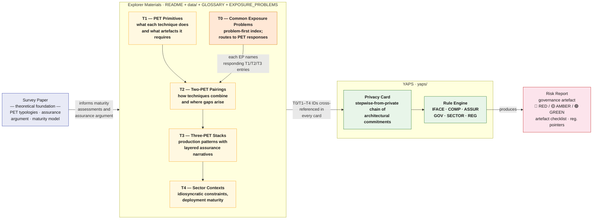

# Privacy Explorer

A companion repository to the survey paper *Survey of PETs Adoption in Real-World Applications* (Smith, 2026) — providing structured, implementation-centred reference materials for reasoning about PET combinations, deployment maturity, and assurance artefacts, together with **YAPS** (Yet Another Privacy Sandbox), a conceptual risk-assessment tool for privacy architecture decisions.

> The survey argues that PET viability depends less on cryptographic strength and more on whether privacy claims can be rendered into repeatable, inspectable assurance artefacts. This repository encodes that argument in two complementary forms: a **problem-first index** (T0 — common exposure problems) and a **technique-first set of relational tables** (T1–T4 — primitives, pairings, stacks, sector contexts).

> **These materials are suggestive and indicative, not prescriptive.** Maturity stage assessments reflect a reading of available peer-reviewed literature and documented deployments at time of writing. Reasonable experts will disagree. The [YAML data files](data/) are the canonical source for forking and revising any entry.

**How to cite this repository:** see [CITATION.cff](CITATION.cff). Please cite both this repository and the survey paper.

---

## Navigation

| Resource | Purpose |
|---|---|
| **This file** | Conceptual architecture and reference tables (T0–T4) |
| [GLOSSARY.md](GLOSSARY.md) | Formalised terms used across the framework, with primary-source citations |
| [EXPOSURE_PROBLEMS.md](EXPOSURE_PROBLEMS.md) | T0 — the problem-first index complementing T1–T4 |
| [STEPWISE_RISK.md](STEPWISE_RISK.md) | The methodology for constructing privacy cards: stepwise-from-private |
| [DIAGRAM.md](DIAGRAM.md) | Visual diagrams — ER schema, combination network, sector map, card architecture |
| [EXCLUDED_COMBINATIONS.md](EXCLUDED_COMBINATIONS.md) | T5 — assessed and excluded combinations, an audit trail for what didn't make T2/T3 and why |
| [TOOLING.md](TOOLING.md) | Where to start looking for a real library per primitive/pairing — high-level pointers, not vetted, PRs welcome |
| [CONTRIBUTING.md](CONTRIBUTING.md) | How to contribute — rules, cards, data entries, tool references |
| [CITATION.cff](CITATION.cff) | Citation metadata for the repository |
| [workshops/](workshops/) | Workshop materials (W1–W4) for testing the framework with practitioners |
| [data/exposure_problems.yaml](data/exposure_problems.yaml) | T0 source data |
| [data/primitives.yaml](data/primitives.yaml) | T1 source data — primitives including DP-L (local) and DP-C (central) variants |
| [data/pairings.yaml](data/pairings.yaml) | T2 source data — two-PET pairings, aligned with survey paper Table 4.2 |
| [data/stacks.yaml](data/stacks.yaml) | T3 source data — three-PET stacks |
| [data/sectors.yaml](data/sectors.yaml) | T4 source data — sector mappings with idiosyncratic constraints |
| [data/exclusions.yaml](data/exclusions.yaml) | T5 source data — assessed/excluded combinations, promotion audit trail |
| [yaps/](yaps/) | YAPS — privacy card architecture and risk engine |
| [yaps/frontend/index.html](yaps/frontend/index.html) | Interactive sandbox — open in a browser, no server required |
| [yaps/cards/examples/](yaps/cards/examples/) | Example privacy cards: healthcare, public sector, finance |
| [yaps/rules/rules.yaml](yaps/rules/rules.yaml) | Risk rule set — fork to contest or extend |
| [yaps/RISK_MODEL.md](yaps/RISK_MODEL.md) | How the risk model works — logic, NIST/NCSC alignment, privacy vs security distinction |
| [yaps/CARDS_GUIDE.md](yaps/CARDS_GUIDE.md) | Modular card guide |
| [workbench/](workbench/) | **WIP** local sandbox — Dockerised FastAPI + Elasticsearch app that consumes the framework's canonical YAML, schemas, and rules for workshop use |

---

## Conceptual Architecture

This repository is structured as three connected layers, each building on the last. The framework can be entered from either a **problem-first** direction (T0 → responding combinations) or a **technique-first** direction (T1 → T2 → T3 → T4) depending on the practitioner's task.



**Layer 1 — Survey paper.** The theoretical foundation: PET typologies, the assurance-gap argument, the claim that deployment viability is determined by whether artefacts can be rendered repeatable and inspectable.

**Layer 2 — Explorer materials (T0–T4).** The argument encoded structurally.
- **T0** ([EXPOSURE_PROBLEMS.md](EXPOSURE_PROBLEMS.md)) is a **problem-first** index — for practitioners who have a concrete exposure problem and want to know which PETs respond.
- **T1–T4** are the **technique-first** tables — for readers who want a relational view of mechanisms, combinations, stacks, and sectors.
- The two views complement each other; T0 and T2 are cross-linked by foreign keys.

**Layer 3 — YAPS.** The argument operationalised at the level of a specific deployment. A Privacy Card commits to a concrete architecture using the **[stepwise-from-private](STEPWISE_RISK.md)** construction methodology: each PET-enabled access pattern is recorded as an explicit deviation from a completely-private baseline, with a named purpose, exposure problem, PET response, trust assumption, assurance anchor, and residual risk. The rule engine surfaces gaps in the resulting chain.

**Cross-cutting:** [GLOSSARY.md](GLOSSARY.md) defines a small, citable vocabulary used consistently across all layers. The [workshops/](workshops/) directory provides materials for testing the framework with practitioners.

---

## Reference materials — T0 through T4

The materials below are designed to be read relationally. **T0** is the problem-first entry point: name your exposure problem, route to responding PETs. **T1–T4** are the technique-first entry point: see what each PET does, how pairs interact, what three-layer stacks exist, how sectors use them. The two views are linked by foreign keys.

Table cells below are deliberately short — a scannable index, not the full record. Where a cell is cut off or shows `(+N more)`, the complete text lives in the linked YAML under [`data/`](data/), generated verbatim by [`scripts/generate_tables.py`](scripts/generate_tables.py).

Cross-references use the short IDs defined in [data/exposure_problems.yaml](data/exposure_problems.yaml) (T0), [data/primitives.yaml](data/primitives.yaml) (T1), and the subsequent tables.

---

### T0 — Common Exposure Problems (problem-first index)

The full T0 index lives in [EXPOSURE_PROBLEMS.md](EXPOSURE_PROBLEMS.md), with canonical entries in [data/exposure_problems.yaml](data/exposure_problems.yaml). A summary:

<!-- AUTOGEN:T0 START — generated by scripts/generate_tables.py from data/exposure_problems.yaml. Do not hand-edit between these markers. -->
| EP | Exposure problem | Primary responding PETs |
| --- | --- | --- |
| `EP-01` | Aggregated outputs may reveal individual records | `DP-C`, `P-07`, `P-08`, `SDC` |
| `EP-02` | Data cannot leave its source for joint computation | `MPC`, `HE`, `FL`, `P-02` |
| `EP-03` | Computation must happen inside an untrusted environment | `TEE`, `HE`, `P-04` |
| `EP-04` | Distributed model training where updates may leak training data | `P-01`, `P-02`, `P-03`, `S-01`, `S-03` |
| `EP-05` | Need to share or republish a dataset-shaped artefact | `SYN`, `P-08`, `S-04`, `P-10` |
| `EP-06` | Repeated, governed access to sensitive data for research | `TRE`, `P-07`, `S-02`, `P-09`, `P-10` |
| `EP-07` | Prove a property without revealing the underlying data | `ZKP`, `P-06` |
| `EP-08` | Cumulative privacy loss across multiple releases | `DP-C`, `DP-L` |
| `EP-09` | Re-identification from quasi-identifiers in low-dimensional release | `DP-C`, `SYN`, `TRE`, `SDC` |
| `EP-10` | Lifecycle controls — withdrawal, retraining, deprecated artefacts | `SYN` |
| `EP-11` | Cross-jurisdictional analytics with conflicting legal regimes | `FL`, `P-04`, `S-01` |

<details>
<summary><code>EP-01</code> — Aggregated outputs may reveal individual records</summary>

- **Description:** An organisation publishes statistics, model parameters, or query answers computed over a sensitive dataset. The release itself can leak per-record information through differencing, reconstruction, or membership inference. The compute environment is not the issue — the release surface is.
- **Disclosure types:**
  - identity
  - attribute
  - membership
  - reconstruction
  - composition_leakage
- **Responding PETs:**
  - `DP-C` — Primary response. Adds calibrated noise to the release; bounds privacy loss formally.
  - `P-07` — DP-C inside a TRE; combines formal output bound with human output checking.
  - `P-08` — When the release is a dataset-shaped artefact, generator + DP.
  - `SDC` — Deterministic alternative: generalise or suppress the disclosive cells directly rather than bound them statistically. No portable privacy guarantee, but the currently mandated response for U.S. Census Bureau and BEA statistical products (DAO 216-26, 2026).
- **Assurance anchors:**
  - privacy accountant
  - parameter manifest (epsilon, delta, sensitivity)
  - output-clearance log
- **Canonical failure mode:** Releasing many marginal statistics without composition accounting — privacy loss compounds; the per-query bound becomes meaningless across a programme.
- **Survey paper refs:** §2.1.3, §2.1.4, §3.4

</details>

<details>
<summary><code>EP-02</code> — Data cannot leave its source for joint computation</summary>

- **Description:** Two or more parties want to compute over their combined data, but no party is permitted (legally, contractually, or commercially) to send raw records to another. The exposure problem is the boundary crossing itself. This covers two computation shapes that are easy to conflate because the same primitives respond to both: computing a joint statistic (a sum, mean, count, or other aggregate) in one pass, and training a joint model over multiple rounds of gradient exchange. The worked examples currently catalogued under this problem (P-02, S-03) are model-training-shaped; a joint-statistic instance — computing a shared metric across independently-governed data holders with no training loop at all, e.g. a federation of data-access nodes answering a query jointly — is equally valid here and does not currently have a worked example of its own.
- **Disclosure types:**
  - identity
  - attribute
  - membership
- **Responding PETs:**
  - `MPC` — Cryptographic joint computation without revealing inputs — applies equally to a one-shot statistic and to per-round model-update aggregation.
  - `HE` — Computation over ciphertexts; party doing the work sees only encrypted state.
  - `FL` — Architectural response: keep data local, exchange model updates only.
  - `P-02` — FL + secure aggregation when individual updates also leak.
- **Assurance anchors:**
  - adversary-model declaration (which corruption threshold, which adversary class)
  - protocol specification and correctness proof
  - communication benchmark (round complexity, bandwidth)
- **Canonical failure mode:** Assuming the MPC adversary model — typically semi-honest — without declaring it. A malicious adversary can deviate from the protocol; "secure under MPC" without the model named is an unsubstantiated claim.
- **Survey paper refs:** §2.1.1, §2.1.2, §2.2.1

</details>

<details>
<summary><code>EP-03</code> — Computation must happen inside an untrusted environment</summary>

- **Description:** Sensitive data is processed on infrastructure (cloud, third-party operator, shared host) where the operator should not be trusted with raw data, but end-to-end encryption is infeasible because the workload needs plaintext to execute. The exposure problem is in-use confidentiality.
- **Disclosure types:**
  - identity
  - attribute
- **Responding PETs:**
  - `TEE` — Hardware-anchored isolation of in-use data and code.
  - `HE` — Cryptographic alternative when TEE is unavailable or untrusted at the hardware level.
  - `P-04` — TEE + DP-C when the *output* also needs protection, not just the in-use state.
- **Assurance anchors:**
  - attestation
  - enclave measurement
  - side-channel mitigation declaration
  - dependency manifest
- **Canonical failure mode:** Treating TEE attestation as a privacy guarantee for outputs. Attestation proves what is running, not that what runs is correct or that the outputs are bounded. An enclave that emits raw aggregates still leaks at the release boundary.
- **Survey paper refs:** §2.2.2, §3.4

</details>

<details>
<summary><code>EP-04</code> — Distributed model training where updates may leak training data</summary>

- **Description:** A model is trained by aggregating updates from multiple clients. The coordinator sees the updates and could, in principle, reconstruct training records (gradient inversion) or infer participation (membership inference).
- **Disclosure types:**
  - identity
  - attribute
  - membership
- **Responding PETs:**
  - `P-01` — FL + DP-C on updates or aggregate. Bounds the leakage from updates.
  - `P-02` — FL + MPC for secure aggregation. Coordinator sees only the sum.
  - `P-03` — FL + TEE. Hardware isolation of the aggregation step.
  - `S-01` — FL + TEE + DP-C. Defence-in-depth: local data, isolated aggregation, bounded output.
  - `S-03` — FL + MPC + DP-C. Coordinator-blind aggregation plus formal output bound.
- **Assurance anchors:**
  - secure-aggregation protocol specification
  - privacy accountant across training rounds
  - attestation (if TEE used)
  - robustness / Byzantine-tolerance report
- **Canonical failure mode:** Treating "raw data stays local" as the privacy claim. The updates leak. FL alone provides architectural minimisation, not formal privacy.
- **Survey paper refs:** §2.2.1, §3.4

</details>

<details>
<summary><code>EP-05</code> — Need to share or republish a dataset-shaped artefact</summary>

- **Description:** Downstream uses require data that *looks like* the source — supporting tool development, training pipelines, model evaluation — but raw release is prohibited. The exposure problem is the release of a data-shaped artefact that could be re-identified or that could leak training records.
- **Disclosure types:**
  - identity
  - attribute
  - membership
  - linkage
- **Responding PETs:**
  - `SYN` — Generate data-shaped artefacts. Privacy depends on the generator and the audit.
  - `P-08` — SYN + DP-C. Formal privacy bound on generator training or release.
  - `S-04` — TEE + SYN + DP-C. Attested DP-trained generation in a hardware-isolated environment.
  - `P-10` — TRE + SYN. A different intent to the other responses here: the synthetic artefact is a development rehearsal for TRE access, not the release deliverable itself — see Simulacrum / ONS synthetic dummy-data practice.
- **Assurance anchors:**
  - disclosure-risk evaluation (MIA, linkage, outlier audit)
  - utility benchmark relative to real-data baseline
  - generator parameter manifest
- **Canonical failure mode:** Releasing high-fidelity synthetic data on the assumption that it is private by construction. Synthetic data without DP coupling or adversarial audit is a release of unmodelled disclosure risk (Stadler et al. 2022).
- **Survey paper refs:** §2.1.5, §3.1

</details>

<details>
<summary><code>EP-06</code> — Repeated, governed access to sensitive data for research</summary>

- **Description:** A custodian needs to allow many researchers to access a sensitive dataset over time, with different projects, different scopes, and different output expectations. The exposure problem is *programmatic* — no single release, but a flow of access and outputs needing accountability.
- **Disclosure types:**
  - identity
  - attribute
  - membership
  - linkage
  - composition_leakage
- **Responding PETs:**
  - `TRE` — Primary response. Institutional layer for safe people / project / data / setting / outputs.
  - `P-07` — TRE + DP-C when statistical releases need a formal bound on top of human checking.
  - `S-02` — TRE + TEE + DP-C for the highest-sensitivity governed analytics.
  - `P-09` — TRE + SDC. Output-clearance workflow enforced with deterministic generalisation/suppression rules rather than (or alongside) a statistical bound — the longest-standing pairing for this exposure problem, predating DP-based approaches.
  - `P-10` — TRE + SYN. Shortens the programmatic-access bottleneck itself: synthetic development data lets researchers write and test code before requesting accredited access, rather than changing what the real-data access regime requires.
- **Assurance anchors:**
  - access audit logs
  - output-clearance log
  - accreditation records (researcher / project)
  - safe-outputs policy
- **Canonical failure mode:** Treating a TRE as a technology rather than a socio-technical regime. Output checking, project approval, and accreditation are the defining assurance mechanisms, not the compute platform.
- **Survey paper refs:** §2.2.2, §4.1.2

</details>

<details>
<summary><code>EP-07</code> — Prove a property without revealing the underlying data</summary>

- **Description:** A party needs to demonstrate a fact about its data (age, eligibility, computational correctness, audit conformance) without disclosing the data itself. The exposure problem is over-disclosure when only a proof is required.
- **Disclosure types:**
  - identity
  - attribute
- **Responding PETs:**
  - `ZKP` — Cryptographic proof of a statement without revealing the witness.
  - `P-06` — TEE + ZKP when the prover environment also requires hardware-anchored protection.
- **Assurance anchors:**
  - circuit definition
  - verification parameters
  - setup transcript (if trusted setup)
  - benchmark report (proof size, prover/verifier time)
- **Canonical failure mode:** Trusting the ZKP system without auditing the circuit. Proofs verify even when the encoded statement is wrong if circuits are under-constrained (Heidari Soureshjani et al. 2023; Chaliasos et al. 2024).
- **Survey paper refs:** §2.1.6, §3.4

</details>

<details>
<summary><code>EP-08</code> — Cumulative privacy loss across multiple releases</summary>

- **Description:** A system makes many releases over time: queries, model versions, periodic statistics. Each release may be acceptable in isolation, but cumulative privacy loss compounds. The exposure problem is *composition*, not any single release.
- **Disclosure types:**
  - composition_leakage
  - membership
  - reconstruction
- **Responding PETs:**
  - `DP-C` — Privacy accountant tracks cumulative loss under a stated composition theorem.
  - `DP-L` — Per-user, per-window epsilon budgeting for telemetry pipelines.
- **Assurance anchors:**
  - privacy accountant with composition theorem named
  - release log linked to budget consumption
  - parameter manifest version-locked to accountant version
- **Canonical failure mode:** Applying epsilon = 1 per release across hundreds of releases without an accountant. The system's effective privacy loss is the sum (or worse under naive composition), not the per-release value (COMP-001 in YAPS rules).
- **Survey paper refs:** §3.4, §3.5

</details>

<details>
<summary><code>EP-09</code> — Re-identification from quasi-identifiers in low-dimensional release</summary>

- **Description:** A release contains attribute combinations that uniquely identify individuals in a population even without direct identifiers (Sweeney 2002; Rocher et al. 2019). The exposure problem is residual identifiability under realistic auxiliary data.
- **Disclosure types:**
  - identity
  - linkage
- **Responding PETs:**
  - `DP-C` — Formal bound on individual-level influence on the release.
  - `SYN` — Smoothing / generative modelling reduces direct identifiability — quality of protection depends on audit.
  - `TRE` — Output checking catches small-cell singling-out via human review.
  - `SDC` — The classical, direct response: generalise the quasi-identifiers or suppress the singling-out cell. Cell suppression and minimum risk-set thresholds are the historical instrument for this exposure problem, predating DP-C and SYN as responses.
- **Assurance anchors:**
  - disclosure-risk evaluation (singling-out test, motivated-intruder simulation)
  - cell suppression and minimum risk-set policies
- **Canonical failure mode:** Equating identifier removal with anonymisation. Pseudonymisation remains personal data; quasi-identifiers carry residual risk (ICO n.d.).
- **Survey paper refs:** §2.1.4, §4.1.1

</details>

<details>
<summary><code>EP-10</code> — Lifecycle controls — withdrawal, retraining, deprecated artefacts</summary>

- **Description:** Data subjects withdraw consent; models trained on their data persist. The exposure problem is the inability to *remove influence* of specific records from deployed artefacts after the fact.
- **Disclosure types:**
  - membership
  - attribute
- **Responding PETs:**
  - `SYN` — Regenerate from a privacy-bounded process rather than retrain on raw data.
  - (no catalogued primitive) — Machine unlearning (Liu et al. 2024) — assurance artefact rather than a PET primitive in T1, but a relevant lifecycle control.
- **Assurance anchors:**
  - change log linked to model versions
  - re-training / unlearning evidence
  - audit log of withdrawal requests honoured
- **Canonical failure mode:** Treating consent withdrawal as a data-deletion operation only. Deployed models retain information about training records (Carlini et al. 2019).
- **Survey paper refs:** §5

</details>

<details>
<summary><code>EP-11</code> — Cross-jurisdictional analytics with conflicting legal regimes</summary>

- **Description:** Data subjects sit in multiple jurisdictions whose data-protection regimes differ (GDPR, UK GDPR, HIPAA, CCPA). The exposure problem is jurisdictional mismatch — a release lawful in one country may be unlawful in another.
- **Disclosure types:**
  - identity
  - attribute
  - linkage
- **Responding PETs:**
  - `FL` — Data stays in jurisdiction; only model updates cross.
  - `P-04` — TEE + DP-C in the recipient jurisdiction with formal output bound.
  - `S-01` — Defence-in-depth for the highest-sensitivity cross-jurisdictional analyses.
- **Assurance anchors:**
  - jurisdictional applicability declaration
  - DPIA reference per jurisdiction
  - cross-border transfer documentation (e.g. SCCs under UK GDPR)
- **Canonical failure mode:** Applying one jurisdiction's controls to data subjects of another. UK-US federated survival analysis (GDS 2025) is the documented worked example.
- **Survey paper refs:** §4.1, §5

</details>
<!-- AUTOGEN:T0 END -->

The T0 index is intentionally a working set, intended to be revised through the [workshops](workshops/). It is **complementary** to T1–T4, not a replacement.

---

### T1 — PET Primitives

The base registry. All IDs in T2–T4 reference the `ID` column here. Algorithmic PETs are shown first, followed by architectural PETs.

Trust-model and assurance-artefact terms are defined in [GLOSSARY.md](GLOSSARY.md).

<!-- AUTOGEN:T1 START — generated by scripts/generate_tables.py from data/primitives.yaml. Do not hand-edit between these markers. -->
| ID | Technique | Family | Maturity |
| --- | --- | --- | --- |
| `DP-L` | Differential Privacy — local (LDP) | Algorithmic | Stage 3 |
| `DP-C` | Differential Privacy — central (CDP) | Algorithmic | Stage 3 |
| `MPC` | Secure Multi-Party Computation | Algorithmic | Stage 2 |
| `HE` | Homomorphic Encryption | Algorithmic | Stage 2 |
| `ZKP` | Zero-Knowledge Proofs | Algorithmic | Stage 2 |
| `SYN` | Synthetic Data | Algorithmic | Stage 2 |
| `FL` | Federated Learning / Distributed Analytics | Architectural | Stage 2 |
| `TEE` | Trusted Execution Environment | Architectural | Stage 3 |
| `TRE` | Trusted Research Environment | Architectural | Stage 4 |
| `SDC` | Statistical Disclosure Control — coarsening & suppression (classical) | Algorithmic* | Stage 4 |
| `DP` | Differential Privacy (family) | Algorithmic | Stage 3 |

<details>
<summary><code>DP-L</code> — Differential Privacy — local (LDP)</summary>

- **Trust model:** Untrusted curator. Each data subject (or their device) adds noise locally before any value leaves the source. The curator never sees raw inputs. Privacy holds against an adversarial curator. The cost is borne in utility: large epsilon values are typically required to extract useful population-level signal, and per-record analytics are impractical.
- **Core artefacts:**
  - parameter manifest (epsilon per release, noise mechanism, sampling rate)
  - privacy accountant tracking cumulative loss per user per day or session
  - parameter manifest declaring whether the LDP scheme is randomised response, RAPPOR-style hashing, or HE-based aggregation with local noise
  - release log (what aggregate statistics were published, against what budget)
  - utility benchmark on the specific statistic of interest
- **Bottleneck:** Utility loss is the dominant cost. Large epsilon values are typical at the population scale; small per-user epsilons rapidly destroy utility for non-trivial analytics.
- **Maturity notes:** Deployed at large scale for telemetry (Google RAPPOR, Apple DP, Google Privacy Sandbox measurement APIs). Tang et al. (2017) document the trade-off between configured epsilon and effective privacy at deployment scale, which remains a contested aspect of these implementations.
- **Key references:**
  - Erlingsson, Pihur & Korolova (2014) — RAPPOR
  - Tang et al. (2017) — Privacy loss in Apple's local-DP implementation
  - Ghazi et al. (2025) — On the differential privacy and interactivity of Privacy Sandbox reports

</details>

<details>
<summary><code>DP-C</code> — Differential Privacy — central (CDP)</summary>

- **Trust model:** Trusted curator. The curator receives raw inputs, computes an aggregate, and applies noise calibrated to the sensitivity of the query before release. The privacy guarantee holds for the release, not within the curator. The trust placed in the curator is independent of the DP guarantee itself — usually satisfied via an institutional or hardware-anchored mechanism (TRE, TEE).
- **Core artefacts:**
  - parameter manifest (epsilon, delta, sensitivity, noise mechanism, clipping norm)
  - privacy accountant tracking composition across queries / training steps
  - sensitivity analysis (how much can a single record shift the query result)
  - release log with composition state
  - utility benchmark relative to non-private baseline
- **Bottleneck:** Parameter governance and composition accounting. Setting epsilon, justifying it, and tracking cumulative loss across a programme of releases are the dominant operational difficulties — not the noise mechanism itself.
- **Maturity notes:** Standardised assurance in some official-statistics contexts (US Census 2020 DAS). Adoption by other national statistical institutes is uneven — the UK ONS has explored DP but continues to favour cell-key perturbation for headline census outputs (Muralidhar et al. 2025; ONS 2023). NIST SP 800-226 (Draft) provides the evaluation framework currently used to assess CDP claims.
- **Key references:**
  - Dwork & Roth (2014) — Algorithmic foundations
  - U.S. Census Bureau (2021) — 2020 Disclosure Avoidance System
  - Abadi et al. (2016) — DP-SGD
  - Muralidhar et al. (2025) — Critical analysis of 2010/2020 Census methods

</details>

<details>
<summary><code>MPC</code> — Secure Multi-Party Computation</summary>

- **Trust model:** Untrusted curator across the participating parties. Adversary model is explicitly declared per protocol: honest-but-curious or malicious; static or adaptive corruption; threshold (k-of-n) corruption bound. Privacy holds as long as the corruption threshold is not exceeded. Survey paper §2.1.1 cites this as the dominant adversary-model variation.
- **Core artefacts:**
  - protocol specification (e.g. SPDZ, ABY3, secret-sharing scheme)
  - adversary-model declaration (semi-honest vs malicious, threshold, static vs adaptive)
  - test vectors and correctness proofs
  - implementation audit (constant-time, side-channel posture)
  - communication benchmark (round complexity, bandwidth per party)
- **Bottleneck:** Communication overhead. Costs scale with party count and circuit depth; in WAN settings, communication dominates compute. Survey paper §3.2 cites 10-1000× plaintext-equivalent slowdowns as indicative rather than stable.
- **Maturity notes:** Selective production in finance (credit scoring, fraud), genomics (iDASH), and benchmarking. Domain-specific frameworks (SPDZ, CrypTen) have improved usability. Survey paper §4.1.3 notes broad deployment limited by overhead and specialist expertise.
- **Key references:**
  - Evans, Kolesnikov & Rosulek (2018) — Pragmatic introduction to MPC
  - Archer et al. (2018) — From keys to databases: real-world MPC applications
  - Knott et al. (2021) — CrypTen

</details>

<details>
<summary><code>HE</code> — Homomorphic Encryption</summary>

- **Trust model:** Data owner trusts the evaluator only with ciphertext. Security rests on lattice-based hardness assumptions (e.g. Ring-LWE). Parameter regime must be selected correctly; misparameterisation can silently void guarantees or destroy utility. CKKS adds approximate-arithmetic considerations that are a separate parameterisation question.
- **Core artefacts:**
  - parameter set and security level (declared in bits)
  - scheme declaration (BFV, BGV, CKKS, TFHE)
  - precision and approximation bounds (especially CKKS)
  - benchmark suite (per-operation timing, memory profile, bit strength)
  - toolchain and library version manifest
- **Bottleneck:** Compute cost (10^3–10^5× plaintext per the survey's indicative figures); memory pressure; workload fit for non-linear operations. Hardware acceleration (FPGA, photonic, Intel Heracles) is shifting this frontier but production at scale remains constrained.
- **Maturity notes:** Emerging with niche production (IBM HE4Cloud in financial services, encrypted identifier checks in cross-jurisdictional fraud screening). Standards activity underway (NIST WPEC 2024). Practical mainly for fixed, small-scale inference or aggregation currently; broader AI workload feasibility addressed in Masalha et al. (2026) and Xue et al. (2025).
- **Key references:**
  - Halevi & Shoup (2020) — Design and implementation of HElib
  - Cheon et al. (2017) — CKKS for arithmetic on approximate numbers
  - Xue et al. (2025) — SoK: Can FHE support general AI computation?
  - Alexandru & Rohloff (2024) — Cross-institutional FHE in financial services

</details>

<details>
<summary><code>ZKP</code> — Zero-Knowledge Proofs</summary>

- **Trust model:** Prover may be malicious; verifier trust anchored in cryptographic soundness of the proof system. Zero-knowledge property depends on proof system, circuit correctness, and setup model. Trusted setup (zk-SNARK) introduces a distinct trust assumption; transparent setups (zk-STARK) avoid this at the cost of proof size. Circuit under-constraint is a known practical failure mode (Heidari Soureshjani et al. 2023).
- **Core artefacts:**
  - circuit definition and arithmetic constraints
  - verification key and setup transcript (if trusted setup used)
  - benchmark report (proof size, prover time, verifier time)
  - implementation and toolchain version manifest (frontend, backend, prover)
  - circuit audit covering under-constraint risk
- **Bottleneck:** Prover compute cost; circuit engineering complexity; under-constraint risk. Hardware acceleration (GPU-Halo2, prover clusters) shifts costs to specialised infrastructure rather than eliminating them.
- **Maturity notes:** Highest maturity in blockchain / Web3 (rollups, verifiable transactions). zk-Bench addresses the reproducibility gap (Koch, Rotaru & Rechberger, 2025). ZKML is emerging but bottlenecked by proving cost and circuit expressiveness; Peng et al. (2026) frame verifiable inference as workflow-specific assurance rather than a general substitute for transparency.
- **Key references:**
  - Ben-Sasson et al. (2022) — zk-STARK
  - Roelink & El-Hajj (2024) — Comparing zkSNARK, zkSTARK, Bulletproof
  - Ernstberger et al. (2023) — zk-Bench
  - Peng et al. (2026) — Survey of ZKP-based verifiable ML

</details>

<details>
<summary><code>SYN</code> — Synthetic Data</summary>

- **Trust model:** Privacy is contingent on the generator, the leakage controls applied during training, the threat model, and the downstream release context. Synthetic data does not provide privacy by construction — formal guarantees require explicit coupling to DP-C or to a documented adversarial audit (e.g. TAPAS). Residual disclosure risk is frequently underestimated in practice (Stadler et al. 2022).
- **Core artefacts:**
  - disclosure-risk evaluation (membership inference, linkage tests, outlier audit)
  - utility benchmark (task performance vs. real-data baseline)
  - attack-based audit (e.g. TAPAS, NIST DP-Synthetic challenge methodology)
  - generation parameters and model version manifest
  - statement of intended use (mechanism validation, pipeline testing, statistical release)
- **Bottleneck:** Validation burden; regulator and procurer acceptance; privacy-utility prediction ex ante. Generators frequently fail to simultaneously prevent inference attacks and preserve downstream utility (survey §3.1).
- **Maturity notes:** High uptake across health (Synthea, Simulacrum, SEARCH), public sector (CMS DE-SynPUF, ONS synthetic data policy), and finance (J.P. Morgan). Assurance practices uneven — many deployments lack formal disclosure-risk evaluation. ICO, ODI, OECD guidance converging on evaluation-first posture (ODI 2025; Steier et al. 2025).
- **Key references:**
  - Stadler, Oprisanu & Troncoso (2022) — Synthetic data anonymisation Groundhog Day
  - McKenna et al. (2021) — Winning the NIST DP synthetic data competition
  - Houssiau et al. (2022) — TAPAS
  - Kaabachi et al. (2025) — Privacy and utility metrics in medical synthetic data

</details>

<details>
<summary><code>FL</code> — Federated Learning / Distributed Analytics</summary>

- **Trust model:** Participants are semi-trusted; the coordinator is typically modelled as honest-but-curious. Raw data stays local but model updates can leak information (gradient inversion: Zhu & Han 2020; participation inference: Nasr et al. 2019). Poisoning and Byzantine update risks require explicit mitigations. Privacy of updates is not guaranteed without additional algorithmic PETs.
- **Core artefacts:**
  - training protocol specification (rounds, client sampling, aggregation rule)
  - aggregation rules and secure-aggregation specification (if used)
  - convergence and robustness reports (Byzantine resilience, non-IID handling)
  - audit logs (round participation, update filtering decisions)
  - data-source de-identification statement (pre-training source controls)
- **Bottleneck:** Communication rounds; non-IID data effects; coordination overhead; update leakage. The survey paper notes that hospital adoption is often gated by site-specific expertise and integration cost (Soltan et al. 2024).
- **Maturity notes:** Pilot-to-operational in healthcare (NVIDIA FLARE, NHS FLIP, OpenSAFELY) and technology (Google Gboard FL with DP). Rarely deployed in sensitive settings without additional algorithmic PETs (DP, secure aggregation).
- **Key references:**
  - McMahan et al. (2017) — Communication-efficient learning of deep networks (FedAvg)
  - Kairouz et al. (2021) — Advances and open problems in federated learning
  - Bonawitz et al. (2017) — Practical secure aggregation
  - Soltan et al. (2024) — NHS FLIP scalable federated learning solution
  - Xu et al. (2023) — Federated Learning of Gboard Language Models with DP

</details>

<details>
<summary><code>TEE</code> — Trusted Execution Environment</summary>

- **Trust model:** Hardware-anchored trust. Trust in hardware vendor, attestation chain, and implementation correctness; OS and hypervisor may be hostile. Side-channel attacks (Foreshadow, Spectre, SGX-specific) are a residual risk. Attestation proves a measured enclave is running on genuine hardware — it does not prove the enclave code is correct.
- **Core artefacts:**
  - attestation report and enclave measurement
  - dependency manifest (enclave code version, libraries, container digest)
  - side-channel mitigation declaration (constant-time, cache flushing, etc.)
  - key management and provisioning audit
  - vendor-trust statement (which vendor, which platform generation)
- **Bottleneck:** Vendor trust; enclave memory limits; operational key management; side-channel posture. Survey paper §3.3 notes that organisations frequently lack the expertise required to deploy TEEs securely (Geppert et al. 2022).
- **Maturity notes:** Commercially deployed across major cloud providers (AWS Nitro Enclaves, Azure Confidential Computing, Google Confidential VMs). CPU-GPU confidential computing for LLM inference is emerging (Mohan et al. 2024; Apple Private Cloud Compute). Increasing audit scrutiny; hybrid PETs typically required to close residual risks.
- **Key references:**
  - Costan & Devadas (2016) — Intel SGX explained
  - Geppert et al. (2022) — TEEs: applications and organisational challenges
  - Apple Security Engineering and Architecture (2024) — Private Cloud Compute
  - Nilsson, Nikbakht Bideh & Brorsson (2020) — Survey of SGX attacks

</details>

<details>
<summary><code>TRE</code> — Trusted Research Environment</summary>

- **Trust model:** Institutional trust plus layered technical and procedural safeguards. Relies on the Five Safes framework (safe people, projects, data, settings, outputs). Output checking and access audits are first-class assurance mechanisms, not optional supplements. TREs are socio-technical control regimes; the assurance argument depends on the institution as well as the technology.
- **Core artefacts:**
  - access audit logs and accreditation records
  - output-clearance workflow and decision log
  - data governance documentation (project approvals, data scope, retention)
  - safe-outputs policy and disclosure-control rules
  - Five Safes alignment statement
- **Bottleneck:** Governance latency; human review throughput; institutional capacity. Output clearance throughput is a binding constraint at scale (ONS 2024; ADR UK 2024).
- **Maturity notes:** Mature in UK public sector (ONS Secure Research Service, NHS England SDE + regional SDEs, ADR UK). The Goldacre Review (2022) catalysed the SDE approach. Increasingly the default for sensitive data access in government and health research; model for audit-ready PET use when combined with algorithmic PETs at the output stage.
- **Key references:**
  - ONS (2024) — Secure Research Service guidance and Safe Outputs
  - ADR UK (2024) — Output clearance process
  - Goldacre Review (2022)
  - FiveSafes.org (n.d.)

</details>

<details>
<summary><code>SDC</code> — Statistical Disclosure Control — coarsening & suppression (classical)</summary>

- **Trust model:** Trusted curator. The curator applies deterministic, rule-based transformations to a table or microdata extract before release. Coarsening covers two operationally distinct sub-methods that are easy to conflate: category generalisation (grouping ages into ranges, broader geography, top/bottom coding) and rounding, which itself splits into random or conventional rounding (each cell rounded independently — simple, but breaks additivity, so published row/column totals no longer equal the sum of the published cells) and controlled rounding (solved as a constrained optimisation so that rounded cells still sum correctly to rounded margins — the form used in production NSI releases, at higher computational cost). Suppression withholds a cell or record from publication once coarsening is insufficient, gated by named rules rather than a single generic "dominance rule": the frequency rule (suppress any cell below a minimum count, typically 3–10 respondents) and the (n,k)-dominance rule for magnitude data (suppress a cell if the largest n contributors — typically n=1–3 — account for more than k% of the cell total, so a single respondent's value could be closely estimated), sometimes supplemented by the p%-rule (suppress if the second-largest contributor could estimate the largest within p% from the published total). Primary suppression (cells failing a rule directly) is followed by secondary suppression: additional cells suppressed so a primary-suppressed cell cannot be recovered by subtraction from row/column totals or from a linked table sharing the same margins. Unlike DP, none of this constitutes a formal privacy definition or a per-record mathematical bound: disclosure risk is assessed against these named rule-based heuristics and against motivated-intruder / singling-out tests, rather than a portable, third-party re-derivable guarantee. Record swapping is a related classical technique but is treated separately here: it perturbs rather than coarsens or suppresses, and is explicitly grouped with noise-based methods (alongside DP and synthetic data) and prohibited, not mandated, by the 2026 U.S. disclosure-avoidance order that motivates this entry (see maturity_notes).
- **Core artefacts:**
  - coarsening/generalisation hierarchy, and rounding method if used (random/conventional vs. controlled rounding, with the rounding base)
  - frequency-rule threshold (minimum cell/population size) and, for magnitude tables, the (n,k)-dominance rule or p%-rule parameters
  - primary and secondary suppression pattern (which cells were suppressed to prevent recovery of primary-suppressed cells by subtraction from margins or from a linked table)
  - disclosure-risk evaluation (singling-out test, motivated-intruder simulation, minimum risk-set size)
  - utility-loss report relative to the uncoarsened / unsuppressed table
- **Bottleneck:** No portable, re-derivable privacy guarantee — risk is assessed heuristically per release, table shape, and threshold choice, so it does not compose across a programme of releases the way a DP accountant does; cumulative disclosure risk across related tables must be re-assessed by hand each time. Utility loss is uneven and table-shape-dependent (small, high-dimensional tables suppress heavily); optimal secondary-suppression selection is an NP-hard combinatorial problem in general (Cox 1980), so production systems use heuristics rather than provably optimal suppression patterns.
- **Maturity notes:** The longest-standing disclosure-control family in official statistics — it predates every other primitive in this registry by decades, and is audit-ready by construction: a minimum-cell-size rule is simple to state in a release policy and easy for a non-specialist reviewer to inspect, which is a different kind of maturity from a DP accountant's formal composition guarantee, not a stronger one. Newly re-mandated rather than newly matured: the U.S. Department of Commerce's Departmental Administrative Order 216-26 (4 June 2026) requires coarsening — defined by the Census Bureau as "reducing the detail of data, for example grouping ages into ranges or rounding" — as the preferred method, with suppression "permitted only as a last resort", for Census Bureau and BEA statistical products, and explicitly prohibits noise infusion (including differential privacy), synthetic data, and record swapping for the same products. This reverses the 2020-cycle move toward DP-C for the same class of release (U.S. Census Bureau 2021) and is the concrete real-world instance motivating this entry (see the position paper, beyond-scalar-epsilon-outline). The UK ONS runs a related but distinct method, cell-key perturbation (small, deterministic per-cell noise keyed to a record key) alongside coarsening/suppression for census tables — closer to a DP-adjacent perturbation method than to this entry, and not currently catalogued separately.
- **Key references:**
  - Hundepool et al. (2012) — Statistical Disclosure Control (Wiley)
  - Willenborg & de Waal (2001) — Elements of Statistical Disclosure Control
  - Cox (1980) — Suppression methodology and statistical disclosure control
  - U.S. Department of Commerce (2026) — Departmental Administrative Order 216-26: Disclosure Avoidance for Statistical Products
  - U.S. Census Bureau (2026) — Understanding the New Disclosure Avoidance Policy
  - U.S. Census Bureau (2021) — 2020 Disclosure Avoidance System
  - Office for National Statistics (2024) — Statistical Disclosure Control policy

</details>

<details>
<summary><code>DP</code> — Differential Privacy (family)</summary>

- **Trust model:** Family-level entry. Differential privacy is parameterised by epsilon (and often delta) and applied either at source (local DP) or after aggregation (central DP). The two variants have materially different trust assumptions and assurance requirements — see DP-L and DP-C for the specific entries. Cards should reference the specific variant.
- **Core artefacts:**
  - see DP-L or DP-C
- **Bottleneck:** See DP-L or DP-C
- **Maturity notes:** Family-level maturity reflects standardised assurance in official statistics (central DP) and consumer telemetry (local DP). Variant-specific maturity in the DP-L and DP-C entries.
- **Key references:**
  - Dwork & Roth (2014) — Algorithmic foundations of differential privacy
  - NIST SP 800-226 (Draft, 2023) — DP evaluation guidelines

</details>
<!-- AUTOGEN:T1 END -->

**Note on DP.** `DP-L` (local) and `DP-C` (central) are distinct primitives with materially different trust assumptions. `DP` is retained as a family pointer for backward compatibility — new cards should reference the specific variant.

**Note on SDC.** *Filed under "Algorithmic" because it transforms the released data directly rather than the compute environment or access regime — but unlike `DP`, `MPC`, `HE`, `ZKP`, it is not rooted in a formal privacy definition, so the fit with the Glossary's "Algorithmic PET" definition is imperfect by design. See [data/primitives.yaml](data/primitives.yaml) for the full caveat and [GLOSSARY.md §4](GLOSSARY.md).

---

### T2 — Two-PET Pairings

Each row combines two primitives from **T1**. The `Pair ID` is referenced in T3 and T4. Combinations are restricted to those with identifiable assurance regimes and production or near-production use cases. The set aligns with the survey paper Table 4.2; each pairing carries a `survey_paper_anchor` field in the YAML pointing to the relevant section.

<!-- AUTOGEN:T2 START — generated by scripts/generate_tables.py from data/pairings.yaml. Do not hand-edit between these markers. -->
| Pair ID | PET A | PET B | Confidence |
| --- | --- | --- | --- |
| `P-01` | `FL` | `DP-C` | deployment_documented |
| `P-02` | `FL` | `MPC` | deployment_documented |
| `P-03` | `FL` | `TEE` | deployment_documented |
| `P-04` | `TEE` | `DP-C` | deployment_documented |
| `P-05` | `TEE` | `MPC` | deployment_documented |
| `P-06` | `TEE` | `ZKP` | theoretical |
| `P-07` | `TRE` | `DP-C` | deployment_documented |
| `P-08` | `SYN` | `DP-C` | peer_reviewed |
| `P-09` | `SDC` | `TRE` | deployment_documented |
| `P-10` | `TRE` | `SYN` | peer_reviewed |

<details>
<summary><code>P-01</code> — FL + DP-C</summary>

- **Combination logic:** Distributed training with formal leakage bounds on model updates (DP-SGD) or on the final model release. The DP layer is typically central (curator-side noise added during aggregation) when the coordinator is trusted; local DP variants exist for cross-device telemetry. Secure aggregation often co-deployed as part of the same stack (see S-03).
- **Survey anchor:** Table 4.2 row 1 (FL + DP); §2.2.1; §4.1.4
- **Artefacts:**
  - privacy accountant (epsilon, delta across training rounds; named composition theorem)
  - clipping norm and noise multiplier parameters
  - convergence and utility monitoring logs
  - DP-SGD configuration manifest
  - aggregation rule and coordinator trust statement
- **Advantage:** Formal privacy bound layered onto distributed training. The most extensively documented combination in the literature. Google Gboard is the canonical production deployment (Xu et al. 2023).
- **Shortcoming:** Accuracy degradation under tight epsilon; accounting complexity compounds across rounds; utility loss hard to predict ex ante for heterogeneous client distributions; DP applied without secure aggregation leaves a coordinator-visibility gap (see S-03).
- **First documented:** 2016
- **Evidence last checked:** 2026-09-25
- **References:**
  - [Xu et al. (2023) — Federated Learning of Gboard Language Models with Differential Privacy](https://aclanthology.org/2023.acl-industry.60/)
  - [Abadi et al. (2016) — Deep learning with differential privacy (DP-SGD)](https://arxiv.org/abs/1607.00133)
  - [Kairouz et al. (2021) — Advances and open problems in federated learning](https://arxiv.org/abs/1912.04977)
  - [Liu et al. (2024) — DP Low-Rank Adaptation under federated learning](https://arxiv.org/abs/2312.17493)

</details>

<details>
<summary><code>P-02</code> — FL + MPC</summary>

- **Combination logic:** Secure aggregation. The coordinator receives only the cryptographically aggregated sum of client updates, not individual contributions. Typically implemented via additive secret sharing with dropout tolerance. Distinct from full MPC over training — applies MPC specifically at the aggregation step. Closes the coordinator-visibility gap that P-01 leaves open.
- **Survey anchor:** §2.2.1 (Bonawitz secure aggregation); supports Table 4.2 FL family entries
- **Artefacts:**
  - secure-aggregation protocol specification
  - adversary-model declaration (semi-honest coordinator; threshold for collusion)
  - dropout and fault-tolerance handling documentation
  - communication overhead benchmark (per round, per client count)
- **Advantage:** Removes coordinator visibility of per-client updates while preserving aggregation correctness. Practically deployed at scale (Bonawitz et al. 2017 cross-device FL). Recent extensions support stateful aggregation for DP-FTRL under an untrusted server model (Ball et al. 2024).
- **Shortcoming:** Communication overhead scales with client count; dropout handling adds protocol complexity; does not bound information leakage *from the aggregate itself* — needs to be paired with DP (see S-03).
- **First documented:** 2017
- **Evidence last checked:** 2026-09-25
- **References:**
  - [Bonawitz et al. (2017) — Practical secure aggregation for privacy-preserving ML](https://doi.org/10.1145/3133956.3133982)
  - Ball et al. (2024) — Secure stateful aggregation for DP-FTRL under untrusted server

</details>

<details>
<summary><code>P-03</code> — FL + TEE</summary>

- **Combination logic:** Local data stays on client devices; the aggregation server runs inside a TEE, providing hardware-enforced confidentiality for the aggregation step and any intermediate model state. Attestation confirms the aggregation code has not been tampered with. Survey paper §2.2.2 cites Intel SGX-based hospital federations as the representative example.
- **Survey anchor:** Table 4.2 row 2 (FL + TEE); §2.2.2 (TEE in federated settings)
- **Artefacts:**
  - attestation report confirming enclave identity and measurement
  - enclave code version manifest
  - aggregation protocol audit
  - side-channel mitigation declaration for the aggregation enclave
  - vendor trust statement
- **Advantage:** Stronger protection for intermediate update state; hardware isolation of the aggregation step reduces need for full cryptographic MPC overhead.
- **Shortcoming:** Hardware vendor trust; enclave memory limits can constrain model size; key management overhead; does not provide formal bounds on output disclosure (see S-01 for DP addition).
- **First documented:** 2021
- **Evidence last checked:** 2026-09-25
- **References:**
  - [Intel (2021) — Intel SGX helps Ping An Technology successfully apply federated learning](https://www.intel.com/content/dam/www/public/us/en/documents/case-studies/ping-an-technology-sgx-case-study.pdf)
  - [NVIDIA FLARE — Federated Learning Application Runtime Environment](https://nvflare.readthedocs.io/)

</details>

<details>
<summary><code>P-04</code> — TEE + DP-C</summary>

- **Combination logic:** TEE provides hardware-enforced in-use confidentiality for computation on sensitive data; central DP provides formal bounds on what the output reveals about any individual. The two mechanisms address orthogonal threat surfaces: TEE protects intermediate state, DP protects the release.
- **Survey anchor:** §2.2.2 (combining TEE with output controls); §3.4 (composability)
- **Artefacts:**
  - attestation report and enclave measurement
  - DP parameter manifest (epsilon, delta, sensitivity, noise mechanism)
  - release log with composition accounting
  - dual trust-model declaration (hardware vendor + parameter governance)
- **Advantage:** Clear functional separation between in-use privacy (TEE) and output disclosure risk (DP). Allows each to be audited independently. Common pattern in cloud-hosted confidential analytics and the basis for several cross-jurisdictional analyses (e.g. the UK-US federated survival pilot described in GDS 2025 layers this further with FL — see S-01).
- **Shortcoming:** Dual trust anchors — hardware vendor and correct DP parameterisation — both require assurance; composability risk if threat models are misaligned.
- **First documented:** 2025
- **Evidence last checked:** 2026-09-25
- **References:**
  - [ONS Secure Research Service](https://www.ons.gov.uk/aboutus/whatwedo/statistics/requestingstatistics/approvedresearcherscheme)
  - [AWS Nitro Enclaves](https://aws.amazon.com/ec2/nitro/nitro-enclaves/)
  - [Government Digital Service (2025) — Using PETs to enable international data sharing](https://gds.blog.gov.uk/2025/10/09/using-privacy-enhancing-technologies-to-enable-international-data-sharing/)

</details>

<details>
<summary><code>P-05</code> — TEE + MPC</summary>

- **Combination logic:** Hardware isolation hosts MPC protocol execution, reducing communication overhead and providing an additional hardware-enforced confidentiality layer for the computation. TEE attestation provides evidence that the correct protocol is running. Survey paper §4.1.3 cites the WEF cross-bank fraud-analytics pilot as the canonical example.
- **Survey anchor:** Table 4.2 row 4 (TEE + SMPC); §2.2.2; §4.1.3 (cross-bank fraud)
- **Artefacts:**
  - attestation report
  - MPC protocol specification and adversary-model declaration
  - implementation audit covering both enclave and protocol layers
  - benchmark evidence (latency, throughput, per-party communication)
- **Advantage:** Performance gain for some MPC workloads; hardware isolation reduces the trust required in the MPC coordinator or aggregator. Enables otherwise impractical multi-party tasks at production latency.
- **Shortcoming:** Hybrid assurance narrative is harder to audit; assurance artefacts span both cryptographic and hardware domains; combined attack surface (cryptanalysis + hardware exploits) requires explicit threat-model fusion; enclave memory limits can constrain MPC circuit size.
- **First documented:** 2019
- **Evidence last checked:** 2026-09-25
- **References:**
  - [World Economic Forum (2019) — Data collaboration for the common good (cross-bank SGX pilot)](https://www3.weforum.org/docs/WEF_Data_Collaboration_for_the_Common_Good.pdf)
  - [Mastercard (2024) — Privacy enhancing technologies (white paper)](https://b2b.mastercard.com/media/z0pnu32l/privacy-enhancing-technologies-white-paper-final.pdf)
  - [MP-SPDZ — Versatile framework for multi-party computation](https://github.com/data61/MP-SPDZ)

</details>

<details>
<summary><code>P-06</code> — TEE + ZKP</summary>

- **Combination logic:** TEE provides hardware isolation for the ZKP prover, protecting sensitive witness data during proof generation. ZKP provides verifiable correctness of the computation result. Together: verifiable execution with reduced intermediate disclosure risk. Most often discussed in the ZKML context (Chen et al. 2024).
- **Survey anchor:** Not in Table 4.2 explicitly; §2.1.6 + §2.2.2 (verifiable execution); deferred / theoretical
- **Artefacts:**
  - attestation report confirming prover enclave
  - circuit definition and verification keys
  - proof artefacts (proof object, verifier time benchmark)
  - implementation assurance (circuit audit, under-constraint check)
- **Advantage:** Combines hardware-enforced prover privacy with cryptographic verifiability. Relevant for verifiable ML inference (ZKML) pipelines where model weights are sensitive.
- **Shortcoming:** Specialised infrastructure; proof generation cost remains a bottleneck; hybrid assurance spans both hardware and cryptographic domains; limited production deployments outside research contexts. Not yet treated by the survey as a primary combination.
- **First documented:** 2023
- **Evidence last checked:** 2026-09-25
- **References:**
  - Chen et al. (2024) — Enabling practical verifiable ML with ZKPs (ZKML)
  - [Ernstberger et al. (2023) — zk-Bench](https://eprint.iacr.org/2023/1503.pdf)
  - Chaliasos et al. (2024) — SoK: What don't we know? Understanding security vulnerabilities in SNARKs

</details>

<details>
<summary><code>P-07</code> — TRE + DP-C</summary>

- **Combination logic:** Central DP output bounds applied within a governed access environment. DP complements (rather than replaces) human output checking — outputs must pass both statistical noise bounding and procedural clearance review. The TRE provides the institutional accountability layer; DP provides the mathematical disclosure bound. Survey paper §4.1.2 cites ONS Safe Outputs policy with DP exploration as the representative example.
- **Survey anchor:** Table 4.2 row 5 (TRE + DP); §4.1.2 (public sector); §3.4 (composability)
- **Artefacts:**
  - output-clearance workflow and decision log
  - DP accountant and parameter manifest
  - release policy documentation
  - access and project approval audit records
  - DPIA or equivalent legal-basis documentation
- **Advantage:** Strong fit for public-sector and accredited research settings. The two mechanisms address distinct failure modes (procedural and statistical). Audit-ready when artefacts are bundled and maintained.
- **Shortcoming:** Governance latency; sign-off burden; DP parameter policy requires non-technical domain input; legal sufficiency of DP evidence varies by jurisdiction (Kenny et al. 2021; Muralidhar et al. 2025).
- **First documented:** 2021
- **Evidence last checked:** 2026-09-25
- **References:**
  - [ONS (2023) — Protecting personal data in Census 2021 results](https://www.ons.gov.uk/peoplepopulationandcommunity/populationandmigration/populationestimates/methodologies/protectingpersonaldataincensus2021results)
  - [ONS (2021) — Applying differential privacy protection to ONS mortality data (pilot)](https://www.ons.gov.uk/peoplepopulationandcommunity/birthsdeathsandmarriages/deaths/methodologies/applyingdifferentialprivacyprotectiontoonsmortalitydatapilotstudy/pdf)
  - [ADR UK (2024) — Five Safes framework for data access](https://www.adruk.org/data-access/data-access-framework/)
  - Stanley & Totty (2024) — Synthetic data and the SIPP Synthetic Beta

</details>

<details>
<summary><code>P-08</code> — SYN + DP-C</summary>

- **Combination logic:** DP formally bounds the privacy loss incurred during generator training (e.g. DP-SGD applied to a GAN, VAE, or tabular generator) or at the point of synthetic dataset release. Without DP coupling, synthetic data provides no formal privacy guarantee; with DP, the release is mathematically bounded but typically lower fidelity. The NIST DP Synthetic Data Challenge is the methodological reference.
- **Survey anchor:** Table 4.2 row 6 (Synthetic data + DP); §2.1.5; §4.1.2 (US Census DP-synthetic pilot)
- **Artefacts:**
  - DP training or release parameter manifest (epsilon, delta, mechanism)
  - privacy/utility evaluation (task performance vs. non-private baseline)
  - membership inference audit results (TAPAS or equivalent)
  - disclosure-risk assessment and linking tests
  - generator code and version manifest
- **Advantage:** More legally and evidentially defensible synthetic release than uncoupled generation. Cleaner assurance narrative than standalone synthetic data. Recognised by ICO, ODI, and US regulators as a viable mechanism for controlled releases.
- **Shortcoming:** Lower fidelity than non-private synthetic data; privacy-utility degradation is data-dependent and hard to predict ex ante; DP-SGD applied to generative models compounds noise across generation steps. Inference attacks remain difficult to anticipate beyond standard DP analysis (Houssiau et al. 2022).
- **First documented:** 2018
- **Evidence last checked:** 2026-09-25
- **References:**
  - [McKenna et al. (2021) — Winning the NIST DP synthetic data competition](https://arxiv.org/abs/2108.04978)
  - [Xie et al. (2018) — Differentially private GAN](https://arxiv.org/abs/1802.06739)
  - [Houssiau et al. (2022) — TAPAS adversarial privacy audit](https://arxiv.org/abs/2211.06550)
  - [Stadler, Oprisanu & Troncoso (2022) — Synthetic data anonymisation Groundhog Day](https://www.usenix.org/system/files/sec22-stadler.pdf)

</details>

<details>
<summary><code>P-09</code> — SDC + TRE</summary>

- **Combination logic:** Deterministic disclosure control (coarsening, suppression) applied to outputs within a governed access environment, in place of — or alongside — a formal statistical bound. The TRE provides the institutional accountability layer (accreditation, output-clearance workflow); SDC provides the release-level protection, assessed by rule-based thresholds and human review rather than a re-derivable privacy parameter. This is the classical pairing that predates P-07 (TRE + DP-C): output checking against the frequency rule and, for magnitude tables, the (n,k)-dominance or p%-rule, is the default disclosure control most TREs were built around, with DP explored later and, in some jurisdictions, since walked back (see DAO 216-26 in SDC's maturity_notes).
- **Survey anchor:** Not in the survey paper (Smith et al. 2026) — added per DAO 216-26 (2026); see beyond-scalar-epsilon-outline.md §4
- **Artefacts:**
  - output-clearance workflow and decision log
  - frequency-rule threshold and, where applicable, (n,k)-dominance or p%-rule parameters
  - primary/secondary suppression pattern
  - disclosure-risk evaluation (singling-out test, motivated-intruder simulation)
  - access and project approval audit records
- **Advantage:** No cryptographic or statistical machinery required; thresholds are simple to state in a release policy and easy for a non-specialist output-checker or regulator to inspect. The longest-documented assurance regime of any pairing in this table — decades of production use in national statistics predate every algorithmic PET here.
- **Shortcoming:** No portable, composable privacy guarantee: risk is reassessed by hand per release and does not accumulate against a tracked budget the way a DP accountant does. Heavy suppression can materially degrade utility for small-area or high-dimensional tables; secondary-suppression selection does not scale as cleanly as an automated noise mechanism once a programme of releases grows large (see SDC bottleneck).
- **First documented:** 2012
- **Evidence last checked:** 2026-09-25
- **References:**
  - [Office for National Statistics (2024) — Statistical Disclosure Control policy](https://www.ons.gov.uk/aboutus/transparencyandgovernance/datastrategy/datapolicies/statisticaldisclosurecontrol)
  - [U.S. Census Bureau (2026) — Understanding the New Disclosure Avoidance Policy](https://www.census.gov/newsroom/blogs/director/2026/08/understanding-the-new-disclosure-avoidance-policy.html)
  - [U.S. Department of Commerce (2026) — Departmental Administrative Order 216-26: Disclosure Avoidance for Statistical Products](https://www.commerce.gov/opog/disclosure-avoidance-statistical-products)
  - Hundepool et al. (2012) — Statistical Disclosure Control (Wiley)

</details>

<details>
<summary><code>P-10</code> — TRE + SYN</summary>

- **Combination logic:** A synthetic "development" dataset, generated to mirror the real dataset's schema and broad statistical properties, is made available outside the TRE so researchers can develop and test analysis code before — and typically as a precondition for — being granted accredited access to the real data inside the TRE itself. The synthetic dataset is not the analysis deliverable; the real analysis still runs on real data under full TRE governance. This is distinct from P-08 (SYN + DP-C): P-08 is a DP-bounded synthetic release *as* the deliverable, whereas P-10 uses synthetic data as a rehearsal artefact that feeds into, and shortens, the TRE access pathway.
- **Survey anchor:** Not in Table 4.2 explicitly — promoted from data/exclusions.yaml E-03 following a 2026-09 evidence re-assessment
- **Artefacts:**
  - synthetic-dataset generation methodology and fidelity statement (what schema and summary statistics it preserves, and what it does not)
  - disclosure-risk evaluation of the synthetic development dataset itself — development-only synthetic data is not automatically risk-free (Stadler et al. 2022)
  - code-development-to-data-release (CDDR) cycle-time tracking
  - standard TRE accreditation and output-clearance workflow (unchanged for the eventual real-data analysis)
- **Advantage:** Shortens the disclosure-review bottleneck substantially: a peer-reviewed evaluation of Simulacrum (a synthetic cancer registry built by Health Data Insight with NHS England's National Disease Registration Service) found an average 2.3-month code-development-to-data-release cycle across 18 projects. Lets a much larger population of researchers explore feasibility and write working code before any of them touch real records, without changing the assurance regime applied to the real-data analysis itself.
- **Shortcoming:** The synthetic development dataset's own disclosure risk is a real, sometimes overlooked, question in its own right: if it is made too faithful to the source data, it constitutes an unmitigated synthetic release (SYN's own bottleneck applies to it directly); if it is not faithful enough, code developed against it may not behave correctly against the real TRE data — a validity gap, not just a privacy one. Whether results and code developed on synthetic data reliably generalise to the real-data analysis is not verified in general.
- **First documented:** 2022
- **Evidence last checked:** 2026-09-25
- **References:**
  - [Health Data Insight / NHS England NDRS (2025) — Leveraging Synthetic Data to Facilitate Research: A Collaborative Model for Analyzing Sensitive National Cancer Registry Data in England](https://link.springer.com/article/10.1007/s43441-025-00820-z)
  - [Office for National Statistics, Data Science Campus — Enabling Data Access through Privacy Preserving Synthetic Data](https://datasciencecampus.ons.gov.uk/enabling-data-access-through-privacy-preserving-synthetic-data/)
  - [NCRAS guide to using the Simulacrum and submitting code](https://assets.publishing.service.gov.uk/media/627398608fa8f57a3d121908/NCRAS_guide_to_using_the_Simulacrum_and_submitting_code.pdf)
  - [Stadler, Oprisanu & Troncoso (2022) — Synthetic data anonymisation Groundhog Day](https://www.usenix.org/system/files/sec22-stadler.pdf)

</details>
<!-- AUTOGEN:T2 END -->

---

### T3 — Three-PET Stacks

Each row extends a pairing from **T2** with one additional primitive from **T1**. Three-layer stacks arise where governance pressure or regulatory stakes justify the added coordination overhead. The `Stack ID` is referenced in T4.

<!-- AUTOGEN:T3 START — generated by scripts/generate_tables.py from data/stacks.yaml. Do not hand-edit between these markers. -->
| Stack ID | Full Stack | Confidence |
| --- | --- | --- |
| `S-01` | FL + TEE + DP-C | deployment_documented |
| `S-02` | TRE + TEE + DP-C | deployment_documented |
| `S-03` | FL + MPC + DP-C | peer_reviewed |
| `S-04` | TEE + SYN + DP-C | theoretical |

<details>
<summary><code>S-01</code> — FL + TEE + DP-C</summary>

- **Base pair:** `P-03` (FL + TEE)
- **Added layer:** `DP-C`
- **Rationale:** Defence-in-depth for distributed training: local data retention (FL) keeps raw data on client devices; hardware isolation (TEE) protects the aggregation server from the host OS and cloud operator; formal output bounds (central DP) limit what the released model reveals about any individual. Each layer addresses a distinct exposure surface, and the assurance artefacts from each compose without overlap.
- **Use case:** NVIDIA FLARE healthcare federated analytics; NHS federated learning pilots (Soltan et al. 2024); the UK-US federated survival analysis pilot described in GDS (2025) for cross-border cancer research.
- **Assurance narrative:** Attestation confirms enclave integrity and correct aggregation code; the privacy accountant bounds statistical leakage at release; protocol audit covers aggregation correctness. Strongest layered assurance for federated analytics currently deployed.
- **Key artefacts:**
  - attestation report (TEE layer)
  - privacy accountant and parameter manifest (DP-C layer)
  - training protocol and aggregation specification (FL layer)
  - output clearance or release log
  - cross-jurisdictional applicability declaration (if applicable)
- **Shortcoming:** Highest coordination cost of the federated stack variants; multi-layer composability risk if TEE and DP threat models are not explicitly aligned; requires expertise spanning systems, cryptography, and privacy engineering.
- **First documented:** 2024
- **Evidence last checked:** 2026-09-25
- **References:**
  - [NVIDIA FLARE — federated learning application runtime environment](https://nvflare.readthedocs.io/)
  - [Soltan et al. (2024) — NHS FLIP scalable federated learning solution](https://www.thelancet.com/journals/landig/article/PIIS2589-7500(23)00226-1/fulltext)
  - [Government Digital Service (2025) — Using PETs to enable international data sharing](https://gds.blog.gov.uk/2025/10/09/using-privacy-enhancing-technologies-to-enable-international-data-sharing/)

</details>

<details>
<summary><code>S-02</code> — TRE + TEE + DP-C</summary>

- **Base pair:** `P-07` (TRE + DP-C)
- **Added layer:** `TEE`
- **Rationale:** Layered public-sector assurance for high-sensitivity governed analytics: institutional access controls and procedural review (TRE) provide accountability; hardware isolation (TEE) protects data in use from the infrastructure operator; formal output bounds (DP-C) constrain statistical disclosure at release. The three layers correspond to three distinct assurance regimes — procedural, hardware, and mathematical — that reinforce rather than duplicate each other.
- **Use case:** ONS Secure Research Service with confidential computing capability; ADR UK accredited data environments; NHS Secure Data Environments operating in cloud environments with attested enclaves.
- **Assurance narrative:** Governance logs and output clearance decisions cover institutional accountability; attestation covers in-use confidentiality of the compute environment; DP accountant covers statistical release. Produces the broadest assurance portfolio of any stack in this registry. Audit-ready when all three artefact sets are maintained.
- **Key artefacts:**
  - access audit logs and output clearance records (TRE layer)
  - attestation report and enclave measurement (TEE layer)
  - DP parameter manifest and accountant (DP-C layer)
  - change-control log across all three layers
- **Shortcoming:** Highest operational complexity and governance overhead in the registry; requires cross-disciplinary teams (governance, systems, privacy engineering); latency from multi-layer approval processes can stall research timelines.
- **First documented:** 2022
- **Evidence last checked:** 2026-09-25
- **References:**
  - [ONS Secure Research Service](https://www.ons.gov.uk/aboutus/whatwedo/statistics/requestingstatistics/approvedresearcherscheme)
  - [ADR UK — data access framework](https://www.adruk.org/data-access/data-access-framework/)
  - [Goldacre Review (2022) — better, broader, safer uses of health data](https://www.gov.uk/government/publications/better-broader-safer-using-health-data-for-research-and-analysis)

</details>

<details>
<summary><code>S-03</code> — FL + MPC + DP-C</summary>

- **Base pair:** `P-02` (FL + MPC)
- **Added layer:** `DP-C`
- **Rationale:** Extends FL + secure aggregation (P-02) by adding formal per-update and output privacy bounds. Secure aggregation ensures the coordinator sees only the cryptographic sum of updates; DP bounds what that sum can reveal about any individual contributor. This stack closes the gap that exists in P-01 (FL + DP without secure aggregation), where a semi-honest coordinator could see individual DP-noised updates.
- **Use case:** Production cross-device FL with untrusted coordinator at scale (Bonawitz et al. 2017 framework); cross-institutional healthcare ML where coordinator trust is explicitly limited.
- **Assurance narrative:** Aggregation correctness and coordinator-blindness from the MPC layer; formal per-user privacy bound from the DP layer; training protocol documentation covers the FL coordination logic. The combined claim — the server learns only a DP-bounded aggregate — is stronger than either P-01 or P-02 alone.
- **Key artefacts:**
  - secure-aggregation protocol specification and correctness proof (MPC layer)
  - privacy accountant across rounds (DP-C layer)
  - training protocol and client participation log (FL layer)
- **Shortcoming:** Communication overhead compounds from both the MPC and FL layers; privacy accounting must correctly model the interaction between secure-aggregation sampling and DP noise; engineering and operational complexity is high.
- **First documented:** 2017
- **Evidence last checked:** 2026-09-25
- **References:**
  - [Bonawitz et al. (2017) — practical secure aggregation](https://doi.org/10.1145/3133956.3133982)
  - Ball et al. (2024) — Secure stateful aggregation for DP-FTRL under untrusted server
  - [Google dp_accounting library](https://github.com/google/differential-privacy/tree/main/python/dp_accounting)

</details>

<details>
<summary><code>S-04</code> — TEE + SYN + DP-C</summary>

- **Base pair:** `P-08` (SYN + DP-C)
- **Added layer:** `TEE`
- **Rationale:** Attested, DP-trained synthetic data generation: the generative model is trained inside a TEE, protecting the source data from the infrastructure operator during training; DP bounds the privacy loss incurred during training and release; the resulting synthetic dataset inherits both hardware-enforced and formal mathematical assurance. Addresses the concern that DP-synthetic generation is only as trustworthy as the environment in which it runs.
- **Use case:** Controlled synthetic data releases in high-sensitivity governed environments; TRE-sandboxed synthetic data where the generation code itself must be attested.
- **Assurance narrative:** Attestation covers the integrity of the generation environment (no tampering with the training code or data pipeline); DP parameters cover statistical disclosure risk at release; disclosure-risk evaluation covers residual re-identification risk in the output. Strongest synthetic assurance posture currently identifiable; rarely deployed outside high-sensitivity contexts.
- **Key artefacts:**
  - attestation report confirming generation enclave (TEE layer)
  - DP training/release parameter manifest and accountant (DP-C layer)
  - disclosure-risk evaluation and utility benchmark (SYN layer)
  - membership inference audit results
- **Shortcoming:** Rarely deployed; specialist infrastructure and multi-domain expertise required; utility loss from DP is compounded by the generative model's own fidelity loss; TEE enclave memory limits can constrain generator architecture.
- **First documented:** 2019
- **Evidence last checked:** 2026-09-25
- **References:**
  - [McKenna et al. (2021) — winning the NIST DP synthetic data competition](https://arxiv.org/abs/2108.04978)
  - [Carlini et al. (2019) — the secret sharer: evaluating generative model memorisation](https://arxiv.org/abs/1802.08232)
  - [Houssiau et al. (2022) — TAPAS](https://arxiv.org/abs/2211.06550)

</details>
<!-- AUTOGEN:T3 END -->

---

### T4 — Sectoral Deployment Context

Maps sectors to their preferred stacks from **T2** and **T3**, with the assurance posture and maturity stage that characterises each. Maturity stages follow the four-level rubric: **(1) Experimental → (2) Repeatable → (3) Standardised assurance → (4) Audit-ready**.

<!-- AUTOGEN:T4 START — generated by scripts/generate_tables.py from data/sectors.yaml. Do not hand-edit between these markers. -->
| Sector | Primary stacks | Maturity |
| --- | --- | --- |
| **Public sector / official statistics / governed research** | `P-07`, `S-02`, `P-09`, `P-08`, `P-10` | Stage 3 |
| **Healthcare / biomedical research** | `P-01`, `P-03`, `S-01`, `P-07`, `P-10` | Stage 2 |
| **Finance / fraud / inter-organisational analytics** | `P-05`, `P-04`, `P-06` | Stage 2 |
| **Technology platforms / consumer AI / large-scale telemetry** | `P-01`, `P-02`, `P-04` | Stage 3 |
| **Web3 / verifiable infrastructure / credential ecosystems** | `P-06` | Stage 2 |

<details>
<summary>Public sector / official statistics / governed research</summary>

- **Typical problem:** High-value sensitive data (census, admin linkage, social policy) requiring repeated access, strong accountability, and public trust. Outputs must be legally defensible and regulatorily compliant. Governance artefacts are as important as technical ones.
- **Primary exposure problems:**
  - `EP-06`
  - `EP-01`
  - `EP-09`
  - `EP-08`
- **Assurance posture:** Output checking, audit logs, reproducible privacy accounting, release policy documentation. Human-in-the-loop clearance is a first-class assurance mechanism.
- **Dominant anchor:** Procedural governance artefacts + formal statistical output control
- **Maturity notes:** Stage 3–4 where PETs slot into existing governance regimes (ONS, US Census, NHS SDEs). Stage 3 is the modal pattern; stage 4 (full audit-readiness) is reached where TRE + DP is operationalised with maintained change-control logs.
- **Blocker:** Governance latency; legal sufficiency of DP evidence varies by jurisdiction; DP parameter policy requires non-technical policy input; standards recognition for newer stacks (e.g. TEE-based confidential analytics) still emerging.
- **Key examples:**
  - ONS Secure Research Service + Safe Outputs
  - ADR UK accredited environments
  - U.S. Census Bureau 2020 DAS (DP-C)
  - NHS England Secure Data Environment
  - UK GDS PETs international data sharing pilot (2025)
- **Legal instruments:**
  - Statistics and Registration Service Act 2007 (UK) — duties on national statistical institutes regarding confidentiality and access
  - Census Act 1920 (UK) and Census Act 2010 — statutory confidentiality of census responses
  - Digital Economy Act 2017 (UK) Part 5 — data-sharing powers for research and statistics with accreditation requirements
  - Federal Information Security Modernization Act (US, FISMA) for federal statistical systems
  - Title 13 of the U.S. Code — confidentiality of census responses, with criminal penalties for disclosure
  - U.S. Department of Commerce (2026) — Departmental Administrative Order 216-26: mandates coarsening and suppression (P-09 / SDC) and prohibits differential privacy, synthetic data, and record swapping, for Census Bureau and BEA statistical products
- **Regulatory expectations:**
  - ICO Anonymisation Code of Practice (UK)
  - ICO PETs Guidance (2023)
  - NIST SP 800-188 — De-Identifying Government Datasets (US)
  - NIST SP 800-226 (Draft) — DP evaluation guidelines (US)
  - Operational interpretation of DP parameters expected at scale: μ-DP equivalent, attack-rate target, or FPR/FNR trade-off curve alongside ε/δ (Desfontaines 2023; interpretable-dp.org).
- **Institutional frameworks:**
  - Five Safes framework (ONS / ADR UK) — projects, people, data, settings, outputs
  - ADR UK accreditation regime for researchers and projects
  - ONS Safe Outputs policy and clearance workflow
  - UK Statistics Authority Code of Practice for Statistics
- **What this implies for PETs:** Mechanisms must produce inspectable artefacts that survive Freedom of Information requests, parliamentary scrutiny, and public release. Procedural-and-statistical layering (TRE + DP) tends to be preferred over pure-cryptographic approaches because the assurance audience includes non-specialists. DP parameter choices are debated publicly (Kenny et al. 2021; Muralidhar et al. 2025) — implies the framework should encourage parameter manifests intended for non-specialist review. DAO 216-26 (2026) shows this debate can also be resolved by mandate rather than evidence: for the products it covers, this framework's P-07/S-02 (DP-based) and P-09 (SDC-based) rows are no longer freely chosen alternatives but are assigned by regulation to different products — the framework records this as a governance fact, not a technical ranking between the two.

</details>

<details>
<summary>Healthcare / biomedical research</summary>

- **Typical problem:** Highly sensitive fragmented data (clinical records, genomics, imaging) held across multiple institutions. Strong scientific and clinical validity requirements. Regulatory compliance and institutional approval processes are non-negotiable constraints. Patient confidentiality is upheld by both statute and common law in many jurisdictions.
- **Primary exposure problems:**
  - `EP-04`
  - `EP-06`
  - `EP-11`
  - `EP-09`
  - `EP-10`
- **Assurance posture:** Clinical validity, robustness monitoring, institutional approval, implementation transparency. Technical privacy artefacts must be accompanied by domain-specific utility evidence (AUROC, task benchmarks).
- **Dominant anchor:** Regulatory and clinical sign-off alongside technical assurance artefacts
- **Maturity notes:** Often stalls between stage 2 and 3 because sign-off burden is non-technical as well as technical. Institutional approval, clinical validation, and fairness / bias analysis are not covered by technical PET artefacts alone. Stage 3 reached in select large-scale deployments (FLIP, OpenSAFELY).
- **Blocker:** Domain-specific validity requirements; multi-stakeholder approval chains; fairness and demographic bias under DP is under-researched; data heterogeneity (non-IID) degrades FL utility; Common Law Duty of Confidentiality (UK) and HIPAA (US) impose constraints that technical PETs do not relieve.
- **Key examples:**
  - NVIDIA FLARE / NHS FLIP (King's College London, 2025)
  - OpenSAFELY (Bennett Institute / NHS England)
  - US-UK PETs Prize Challenge (2022–2023)
  - Soltan et al. (2024) — Raspberry Pi NHS COVID-19 federated screening
  - Froelicher et al. (2021) — federated HE for genomics
- **Legal instruments:**
  - GDPR Article 9 — special-category data: explicit consent or specific lawful basis (e.g. Art. 9(2)(j) for research); applies to UK GDPR too
  - Health Insurance Portability and Accountability Act (US, HIPAA) Privacy Rule and Security Rule
  - Common Law Duty of Confidentiality (UK) — applies to patient information even where GDPR also applies; section 251 NHS Act 2006 provides a mechanism for set-aside in research
  - Health Research Authority (UK) and Confidentiality Advisory Group approval pathways
  - 21st Century Cures Act (US) and ONC Information Blocking Rule — interoperability requirements that interact with privacy controls
  - EU Health Data Space Regulation (Reg. 2025/327, effective 2026) — proposed framework for secondary use of health data with PET requirements
- **Regulatory expectations:**
  - MHRA / FDA expectations for software-as-medical-device validity
  - NICE clinical evidence frameworks (UK)
  - ICO guidance on health data (UK)
  - NHS Digital Data Security and Protection Toolkit (DSPT)
  - WHO ethics guidance for AI in health
- **Institutional frameworks:**
  - NHS Secure Data Environment network (England) — single-entry approach since 2024 following the Goldacre Review
  - Health Data Research Service (HDRS, UK) — standardised access agreements
  - Research Ethics Committees (RECs, UK) and Institutional Review Boards (IRBs, US)
  - Clinical governance: indemnity, sponsor responsibility, data controller determination
- **What this implies for PETs:** Pre-existing clinical governance (REC/IRB approval, sponsor agreements, section 251 approvals) often gates PET deployment regardless of technical merit. Architectural-first patterns (TRE, FL with local de-identification at source) dominate because they integrate with existing institutional controls; pure algorithmic responses (HE on raw clinical data crossing institutions) face higher non-technical barriers even when technically feasible. The framework should make this explicit: a 'private' technical solution that does not also accommodate REC review, sponsor sign-off, and DSPT is not deployable in practice.

</details>

<details>
<summary>Finance / fraud / inter-organisational analytics</summary>

- **Typical problem:** Strong commercial incentive for joint analysis across organisational boundaries (banks, insurers, payment networks) without pooling raw data. Latency and throughput matter. Regulatory compliance and audit requirements are sector-specific and vary by jurisdiction. Production use tends to demand deterministic reproducibility for model and risk decisions.
- **Primary exposure problems:**
  - `EP-02`
  - `EP-03`
  - `EP-07`
  - `EP-11`
- **Assurance posture:** Threat-model clarity, implementation audit, benchmarked performance, correctness verification. Performance evidence and cryptographic audit substitute for public-sector-style procedural governance.
- **Dominant anchor:** Technical performance evidence and implementation audit, framed for model-risk governance
- **Maturity notes:** Stage 2–3. Strongest uptake where high-value cross-party use cases justify specialist engineering (credit scoring, fraud, benchmarking). MPC and TEE deployments are the most production-mature. HE and ZKP remain largely at stage 2 outside blockchain-adjacent contexts.
- **Blocker:** Compute and communication overhead for MPC and HE at scale; commercial incentive required to offset engineering cost; regulatory acceptance of cryptographic assurance artefacts varies across jurisdictions; AI-risk and model-explainability expectations interact with stochastic privacy mechanisms.
- **Key examples:**
  - Bogetoft et al. (2009) — MPC for Danish agriculture (foundational)
  - WEF / BCG cross-bank SGX pilot (2019)
  - Mastercard confidential analytics (2024)
  - IBM HE4Cloud in financial services (Intesa Sanpaolo, 2020+; HE4Cloud 2025)
  - Future of Privacy Forum (2025) — cross-jurisdictional FHE fraud screening
- **Legal instruments:**
  - Gramm-Leach-Bliley Act (US, GLBA) — financial privacy obligations
  - Bank Secrecy Act / Anti-Money-Laundering Acts (US, BSA/AML, UK MLR 2017) — counter-balancing obligations that constrain privacy approaches in fraud / AML contexts
  - EU MiFID II and PSD2 — investment-services and payment-services obligations affecting joint analytics
  - EU Markets in Crypto-Assets Regulation (MiCA, in force 2024)
  - GDPR and UK GDPR — apply to personal data in financial services
- **Regulatory expectations:**
  - FCA model risk management expectations (SS1/23 UK PRA; equivalents elsewhere) — demand model documentation, validation, monitoring
  - PCI-DSS — payment-card security baselines applicable to any card-data processing
  - Basel Committee on Banking Supervision guidance on AI / model risk
  - Bank for International Settlements (FSI Occasional Paper 24, 2025) on AI explainability — implies that any privacy mechanism affecting outputs must remain explainable and auditable
- **Institutional frameworks:**
  - Three lines of defence — first-line business, second-line risk and compliance, third-line internal audit; PET deployments must satisfy all three
  - Independent model validation (typically pre-production gating)
  - Operational resilience requirements (DORA in EU, FCA in UK)
- **What this implies for PETs:** Mechanisms that introduce stochastic distortion (e.g. DP applied to risk-scoring outputs) can be hard to reconcile with model-explainability and reproducibility expectations. Deterministic-output mechanisms (MPC on encrypted inputs, HE-based encrypted-identifier checks returning true/false) often fit better with sectoral assurance. The framework should make this visible — PETs are not all equally interpretable in sectors with strong model-governance regimes.

</details>

<details>
<summary>Technology platforms / consumer AI / large-scale telemetry</summary>

- **Typical problem:** Massive scale (billions of users), continuous telemetry and model update streams, infrastructure integration constraints. Privacy must be built into production pipelines rather than applied as a bespoke overlay. Parameter governance and accountability at scale are dominant concerns.
- **Primary exposure problems:**
  - `EP-08`
  - `EP-04`
  - `EP-01`
  - `EP-03`
- **Assurance posture:** Parameter governance, continuous privacy accounting, interface discipline, systems integration. Accountability of composition across many releases is a distinct challenge at this scale.
- **Dominant anchor:** Accountable, continuously monitored production pipelines
- **Maturity notes:** Stage 3 where PETs are built directly into platform infrastructure (Google Privacy Sandbox, Apple DP-L telemetry, Google Gboard FL + DP). Parameter drift and regulatory clarity on epsilon values at population scale remain open concerns. Recent independent analyses of Privacy Sandbox measurement DP (Ghazi et al. 2025) and Apple LDP parameters (Tang et al. 2017) flag ongoing transparency questions.
- **Blocker:** Accountability of composition over millions of releases; regulatory clarity on what constitutes adequate DP parameterisation at platform scale; interface discipline to prevent accidental non-private fallbacks; DMA / DSA data-sharing obligations introducing new exposure surfaces that pre-date corresponding PET guidance.
- **Key examples:**
  - Google RAPPOR (Erlingsson et al. 2014) and Privacy Sandbox (2024)
  - Apple DP telemetry (Tang et al. 2017)
  - Google Gboard FL with DP (Xu et al. 2023)
  - Meta / Mozilla Interoperable Private Attribution (2023)
- **Legal instruments:**
  - GDPR / UK GDPR — applies to platforms serving European users
  - California Consumer Privacy Act (CCPA) and California Privacy Rights Act (CPRA)
  - Other US state laws (Virginia VCDPA, Colorado CPA, etc. — fragmented)
  - ePrivacy Directive (EU) — telemetry, cookies, communications metadata
  - EU Digital Markets Act (DMA, 2024–) — data-sharing obligations for gatekeeper platforms
  - EU Digital Services Act (DSA, 2023–) — transparency and risk-assessment obligations interacting with telemetry processing
  - EU AI Act (2024–) — risk-based AI obligations, affects telemetry use for ML systems
- **Regulatory expectations:**
  - ICO PETs Guidance (UK)
  - FTC enforcement actions on telemetry / consent (US)
  - Regulator scrutiny of Privacy Sandbox-style measurement APIs (UK CMA, ICO)
  - Operational interpretation of DP parameters expected at scale: μ-DP equivalent, attack-rate target, or FPR/FNR trade-off curve alongside ε/δ — single-ε reporting at platform scale hides the trade-off (Desfontaines 2023; Ghazi et al. 2025).
- **Institutional frameworks:**
  - Privacy review programmes within platforms (Google, Apple, Meta)
  - External audit and conformance regimes (ISO/IEC 27701 for privacy information management)
  - Industry consortia for measurement (Privacy Sandbox, Interoperable Private Attribution)
- **What this implies for PETs:** Platforms can enforce uniform client behaviour and interface constraints that cross-institutional settings cannot. This makes large-scale DP and FL more viable but creates a portability problem: techniques that work for a single platform owner do not necessarily transfer to multi-party settings (Troncoso et al. 2017). The framework should be explicit that platform-scale maturity is not generalisable maturity.

</details>

<details>
<summary>Web3 / verifiable infrastructure / credential ecosystems</summary>

- **Typical problem:** Need to prove correctness, eligibility, or compliance with minimal disclosure in permissionless or low-trust environments. Cryptographic verification serves as the primary governance mechanism; procedural human-in-the-loop review is absent or minimal by design.
- **Primary exposure problems:**
  - `EP-07`
  - `EP-02`
- **Assurance posture:** Proof-system soundness, circuit correctness, benchmark reproducibility, trusted-setup transparency. Cryptographic verification is the assurance anchor; governance artefacts in the public-sector sense are largely absent.
- **Dominant anchor:** Cryptographic proof as the sole or primary assurance mechanism
- **Maturity notes:** Stage 2–3 where cryptographic verification itself is the assurance anchor (blockchain rollups, verifiable transactions). Stage 1–2 outside these contexts. zk-Bench and related tooling are improving reproducibility. ZKML and ZKP credential ecosystems (eIDAS 2.0, W3C VC 2.0) remain stage 1–2.
- **Blocker:** Proof generation cost; circuit under-constraint risk (Heidari Soureshjani et al. 2023; Chaliasos et al. 2024); irreproducible benchmarks limiting comparability; limited standardisation outside blockchain; governance misalignment when ZKP is proposed for public-sector contexts expecting procedural accountability.
- **Key examples:**
  - zk-SNARK rollups (Ethereum, StarkWare)
  - Babel & Sedlmeir (2023) — ZKP anonymous credentials
  - W3C Verifiable Credentials 2.0 (2025)
  - eIDAS 2.0 European Digital Identity framework
- **Legal instruments:**
  - EU eIDAS 2.0 (Regulation 2024/1183) — establishes European Digital Identity Wallet framework; ZKP integration remains an open implementation question
  - EU Markets in Crypto-Assets Regulation (MiCA, in force 2024)
  - US state-level approaches (varying)
- **Regulatory expectations:**
  - W3C Verifiable Credentials 2.0 (W3C Recommendation, 2025)
  - ISO/IEC working items on decentralised identifiers and ZKP
  - Variable national positions on cryptographic credentials
- **Institutional frameworks:**
  - Open-source consortia and standards bodies (W3C, IETF, DIF)
  - Layer-1 protocol governance
  - Limited or absent procedural accountability layer compared with public sector
- **What this implies for PETs:** Cryptographic proof substitutes for procedural governance, but the substitution is contestable in regulatory contexts (Babel & Sedlmeir 2023; Ramos Fernández 2024). The framework should flag that ZKP-as- primary-assurance may not transfer to sectors expecting procedural accountability. This is a key portability question for cross-sector ZKP claims.

</details>
<!-- AUTOGEN:T4 END -->

---

## Assurance Maturity Rubric

The maturity stages referenced in T4 are defined as follows. Technical robustness does not imply procurement maturity: a PET can be cryptographically strong and remain at Stage 1 if its artefacts are not renderable into repeatable, inspectable claims.

| Stage | Technical Profile | Assurance Profile | Operational Profile | What Typically Blocks Progression |
|-------|-------------------|-------------------|---------------------|------------------------------------|
| **1 — Experimental / Pilot** | Mechanism demonstrated on constrained workload | Evidence local to a paper, demo, or prototype | Limited documentation; specialist operators required | No stable assurance artefacts; unclear deployment costs |
| **2 — Repeatable Deployment** | Workflow can be re-run with known dependencies and constraints | Parameter choices, threat model, and outputs documented | Playbooks and known failure modes exist | Lack of standardised reporting or cross-team confidence |
| **3 — Standardised Assurance** | Comparable implementation patterns exist across settings | Shared artefacts emerge: accountants, attestation patterns, benchmark conventions, output-control records | Internal review and vendor comparison are tractable | Weak legal or procurement recognition; sector-specific gaps remain |
| **4 — Audit-Ready / Procurement-Ready** | Technology integrates into production controls and monitoring | Third-party or regulator-facing artefacts support scrutiny | Can be specified in contracts, review processes, and change-control | High maintenance cost; residual legal ambiguity in some contexts |

---

## How to construct a privacy card

Cards in this repository are built using the **stepwise-from-private** methodology in [STEPWISE_RISK.md](STEPWISE_RISK.md). The short version, for readers who want the construction shape before reading the full document:

1. **Start at step 0 — the completely-private baseline.** Data sits at source; no flow; no analysis; trivial privacy and trivial utility.
2. **Each subsequent step is one deviation from baseline.** A step adds a single PET (or a coordinated bundle) for one named purpose.
3. **Every step records the same six fields:**
   - `purpose` — why this step is needed.
   - `exposure_problem_ref` — the [T0](EXPOSURE_PROBLEMS.md) `EP-` identifier this step introduces or addresses.
   - `pet_added` — the T1 primitive(s) added (e.g. `FL`, `DP-C`, `TEE`).
   - `trust_assumption_added` — the trust the step now requires, in [glossary](GLOSSARY.md) vocabulary.
   - `assurance_anchor` — the artefact that makes the step's privacy claim credible.
   - `residual_risk` — what remains exposed for subsequent steps to address.
4. **The card is the ordered chain of steps.** A reviewer reads the chain top-to-bottom and asks: is each step's purpose legitimate, is each assurance anchor produced, is each trust assumption acceptable, and is the final residual tolerable for the use?
5. **YAPS validates the chain.** The rule engine (`yaps/engine/risk_engine.py`) checks that each step is well-formed (`STEP-*` rules), that the declared exposure problems align with the chosen PETs (`T0-*`), that DP variants have the right per-variant artefacts (`DP-VAR-*`), and that cross-jurisdictional deployments declare a cross-border mechanism (`JURIS-*`).

[yaps/cards/examples/cross_jurisdictional_fl_tee_dpc.json](yaps/cards/examples/cross_jurisdictional_fl_tee_dpc.json) is the worked example of all five points above.

---

## YAPS — Privacy Card Architecture

YAPS (Yet Another Privacy Sandbox) is the practitioner-facing component of this repository. Where the explorer tables describe *what exists and how it combines*, YAPS asks: *what happens when you commit to a specific architecture in a specific context?*

**Card construction follows the [stepwise-from-private methodology](STEPWISE_RISK.md):** each PET-enabled access pattern is recorded as an explicit deviation from a completely-private baseline. The card is the ordered chain of such deviations, each with named purpose, exposure problem, PET response, trust assumption, assurance anchor, and residual risk. This addresses the recursive DPIA critique that asking "what is the privacy risk?" when the risk is unknown does not produce effective mitigation.

A **Privacy Card** is a structured JSON document with five layers, each independently configurable:

| Layer | What it records | Explorer anchor |
|---|---|---|
| **Data layer** | Data categories, sensitivity, linkage risks, Solid / access-control intent | Data profile schema |
| **PET layer** | Primitives in use (T1 IDs incl. `DP-L`/`DP-C`), roles, tooling, parameters | T1 `primitive_id` |
| **Assurance layer** | Required artefacts and their current status | T2 / T3 artefact lists |
| **Governance layer** | Output controls, audit logs, DPIA, frameworks applied | T4 assurance posture; idiosyncratic constraints |
| **Regulatory layer** | Applicable regulations, standards alignment, jurisdictional declarations | NIST, ICO, GDPR; T4 legal instruments |

Cards reference both T0 exposure problems (the rationale for each PET choice) and T1–T4 identifiers (the anchor to the reference base).

The **risk engine** evaluates a card against the rule set in [yaps/rules/rules.yaml](yaps/rules/rules.yaml) and produces a traffic-light report (🔴 RED / 🟡 AMBER / 🟢 GREEN). The **interactive frontend** ([yaps/frontend/index.html](yaps/frontend/index.html)) lets readers compose and evaluate architectures in a browser without any tooling — useful for drive-by readers and quick demos. Full documentation is in [yaps/](yaps/).

For workshop use, a persistent local sandbox is available in [`workbench/`](workbench/): a Dockerised FastAPI + Elasticsearch app that consumes the framework's canonical YAML, schemas, and rules. Practitioners can author, save, version, search, and re-evaluate multiple cards over a workshop session, and ingest result records from [`privacy-eval/`](privacy-eval/) directly into a card's schema 1.2 `risk_calibration` block. The workbench is explicitly **WIP** — research scaffolding, local-only, no auth — see [`workbench/limitations.md`](workbench/limitations.md). It coexists with the single-file frontend; they serve different audiences.

### Schema 1.2 — operational reporting of DP claims

Schema 1.2 adds an optional `risk_calibration` block to the card, allowing DP claims to be reported as a μ-DP value, an operational attack-rate target, a conversion regret bound, and a reference to an FPR/FNR trade-off curve — alongside the existing (ε, δ). This addresses the critique that single-ε reporting hides the underlying privacy trade-off (Desfontaines 2023). The tooling integration uses [interpretable-dp.org](https://interpretable-dp.org/)'s **`gdpnum`** (μ-DP conversion + curves; card-side reporting helper) and **`riskcal`** (noise calibration from a target attack rate; attack-simulation helper). A new `RISKCAL-*` rule category in YAPS nudges cards toward this richer reporting; current severities are GREEN/AMBER/INFO — workshop feedback may justify later escalation.

---

## Repository Structure

```
privacy-explorer/
├── README.md                       # This file — conceptual map and reference materials
├── GLOSSARY.md                     # Formalised terms with primary-source citations
├── EXPOSURE_PROBLEMS.md            # T0 — problem-first index
├── STEPWISE_RISK.md                # Card construction methodology: stepwise-from-private
├── CITATION.cff                    # Citation metadata
├── CONTRIBUTING.md                 # Contribution guide
├── DIAGRAM.md                      # Mermaid diagrams: schema, combination network, sector map
├── EXCLUDED_COMBINATIONS.md        # T5 — assessed/excluded combinations audit trail
├── TOOLING.md                      # Library pointers per primitive/pairing — loose, PR-welcome
├── data/
│   ├── exposure_problems.yaml      # T0 canonical source
│   ├── primitives.yaml             # T1 canonical source (DP-L, DP-C variants)
│   ├── pairings.yaml               # T2 canonical source (survey-paper-anchored)
│   ├── stacks.yaml                 # T3 canonical source
│   ├── sectors.yaml                # T4 canonical source (idiosyncratic constraints)
│   └── exclusions.yaml             # T5 canonical source (assessed/excluded, promotion trail)
├── workbench/                      # WIP local sandbox (Dockerised FastAPI + Elasticsearch)
│   ├── README.md                   # Setup + scope
│   ├── limitations.md              # What this is NOT (no auth, no TLS, no multi-user)
│   ├── docker-compose.yml          # ES + backend orchestration
│   └── backend/                    # FastAPI app importing yaps.engine.risk_engine
├── workshops/                      # Workshop materials (W1–W4) for testing the framework
│   ├── README.md
│   ├── W1-exposure-problems.md
│   ├── W2-card-construction.md
│   ├── W3-sector-deepening.md
│   ├── W4-design-and-visuals.md
│   ├── OPEN_QUESTIONS.md
│   ├── DESIGN_DECISIONS.md
│   ├── FACILITATOR_NOTES.md
│   └── PARTICIPANT_PROFILES.md
└── yaps/
    ├── README.md                   # YAPS overview and architecture
    ├── CONTRIBUTING.md             # YAPS contribution guide
    ├── RISK_MODEL.md               # Risk logic, rule narratives, NIST/NCSC alignment
    ├── CARDS_GUIDE.md              # Modular card guide; stepwise-from-private examples
    ├── schemas/                    # JSON Schemas: privacy_card + data_profile
    ├── rules/rules.yaml            # Rule set — fork to contest or extend
    ├── engine/                     # risk_engine.py — Python CLI evaluator
    ├── cards/                      # examples/ and templates/
    └── frontend/                   # index.html — single-file interactive sandbox
```

---

## Key References

The tables above draw on the following works. Full bibliography is available in the survey paper.

**Foundational theory**
- Dwork & Roth (2014) — Algorithmic foundations of differential privacy
- Evans et al. (2018) — A pragmatic introduction to secure MPC
- Costan & Devadas (2016) — Intel SGX explained

**Empirical follow-on**
- Smith (2026) — *Beyond scalar epsilon: stepwise privacy cards for federated learning* (FLTA 2026 short paper). Companion evaluation harness in [stepwise-privacy-cards](https://github.com/j0hn-s/stepwise-privacy-cards) (sibling checkout: `../stepwise-privacy-cards/`). Empirically validates the privacy card concept and the [stepwise-from-private methodology](STEPWISE_RISK.md) through a worked FL deployment on the MedMNIST v2 BloodMNIST benchmark, with per-record MIA + gradient inversion calibrating the card's `risk_calibration` block.

**Federated learning**
- McMahan et al. (2017) — Communication-efficient learning of deep networks (FedAvg)
- Kairouz et al. (2021) — Advances and open problems in federated learning
- Bonawitz et al. (2017) — Practical secure aggregation for federated learning
- Hard et al. (2018) — Federated learning for mobile keyboard prediction (Google Gboard)
- Soltan et al. (2024) — NHS FLIP: federated learning in health

**Differential privacy in deployment**
- Abadi et al. (2016) — Deep learning with differential privacy (DP-SGD)
- McKenna et al. (2021) — Winning the NIST DP synthetic data competition
- U.S. Census Bureau (2021) — 2020 Disclosure Avoidance System

**Synthetic data and re-identification**
- Stadler et al. (2022) — Synthetic data anonymisation groundhog day
- Houssiau et al. (2022) — TAPAS: tricks to accelerate privacy-relevant audits
- Carlini et al. (2019) — The secret sharer: evaluating generative model memorisation

**Zero-knowledge proofs**
- Ben-Sasson et al. (2022) — Succinct non-interactive zero-knowledge proofs
- Ernstberger et al. (2023) — zk-Bench: standardised benchmarking of ZKPs

**Homomorphic encryption**
- Halevi & Shoup (2020) — Design and implementation of HElib

**Governance and standards**
- NIST SP 800-226 (Draft, 2023) — Guidelines for evaluating differential privacy guarantees
- NIST Privacy Framework 1.0 (2020)
- ICO Anonymisation Code of Practice (2022)
- ICO PETs Guidance (2023)
- OECD (2023) — Emerging Privacy-Enhancing Technologies
- ONS (2021–2024) — Safe Outputs and Secure Research Service guidance
- Goldacre Review (2022) — Better, broader, safer uses of health data
- Royal Society (2019) — Privacy-preserving digital technologies

**Healthcare federated deployments**
- Sheller et al. (2020) — Federated learning in medical imaging
- OpenSAFELY / Bennett Institute documentation
